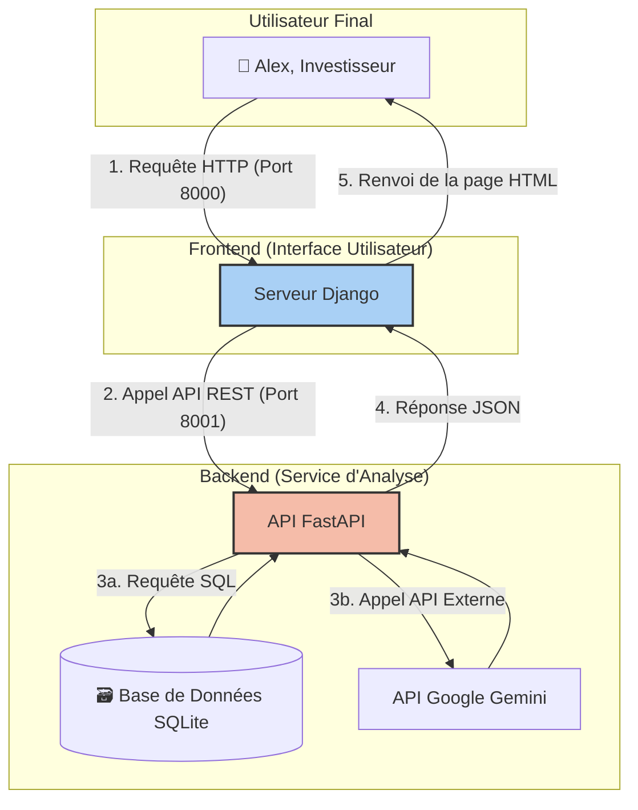

# Bitcoin Analyzer 📈


Bitcoin Analyzer est une application web full-stack, pilotée par l'IA, conçue pour fournir un tableau de bord complet aux investisseurs en Bitcoin. Elle centralise les données de marché, agrège les actualités pertinentes et offre une analyse de tendance générée par l'IA pour simplifier la prise de décision.

Ce projet a été développé en tant que projet de certification finale pour le titre RNCP Niveau 6 "Développeur en Intelligence Artificielle". Il démontre un ensemble complet de compétences, de l'ingénierie des données à l'intégration de services d'IA, en passant par le développement web full-stack et les pratiques MLOps.

## 🏛️ Architecture

Le projet est construit sur une architecture microservices moderne et découplée pour garantir la scalabilité, la maintenabilité et une séparation claire des responsabilités.



### Flux de données :
1. **Utilisateur -> Django** : L'utilisateur accède au tableau de bord (port 8000).
2. **Django -> FastAPI** : La vue Django agit comme un client, appelant l'API backend (port 8001) pour récupérer toutes les données nécessaires.
3. **FastAPI -> Sources de données** :
   - L'API interroge la base de données SQLite pour l'historique des prix et les actualités.
   - L'API appelle le service Google Gemini pour générer une analyse de tendance.
4. **FastAPI -> Django** : L'API agrège les informations et les retourne à Django au format JSON.
5. **Django -> Utilisateur** : Django utilise les données pour populer un template HTML et renvoie la page web complète au navigateur de l'utilisateur.

## ✨ Fonctionnalités Clés

### ⚙️ Pipeline d'Ingénierie des Données:
- **Extraction API**: Collecte automatisée des données de marché (OHLCV) via l'API Coinalyze.
- **Web Scraping**: Extraction des dernières actualités depuis Bitcoin Magazine avec BeautifulSoup.
- **Extraction SQL**: Capacité à extraire des données depuis une base de données "legacy" simulée.
- **Stockage Centralisé**: Stockage des données nettoyées dans une base SQLite.

### 🚀 API Backend Haute Performance:
- Développée avec FastAPI pour une réactivité maximale.
- Expose des endpoints clairs pour les prix, l'historique et les actualités.
- Documentation interactive auto-générée avec Swagger UI.

### 🧠 Analyse par IA:
- Intégration du modèle Google Gemini Pro pour l'analyse de tendance.
- Génère des résumés en langage naturel, accessibles aux non-experts.
- Le choix du modèle est justifié par un benchmark formel (voir docs/benchmark_ia.md).

### 🖥️ Tableau de Bord Frontend Moderne:
- Application Django agissant comme un client de l'API.
- Interface utilisateur propre et responsive pour visualiser les données et l'analyse de l'IA.
- Gestion robuste des erreurs si le service backend est indisponible.

### ✅ Bonnes Pratiques MLOps & DevOps:
- **Tests Automatisés**: Suite de tests complète avec pytest, incluant des tests unitaires (avec mocking pour l'IA) et des tests d'intégration pour l'API.
- **Pipeline CI/CD**: Chaîne d'intégration continue avec GitHub Actions qui automatise les tests et le build de l'image Docker à chaque commit.
- **Conteneurisation**: L'API est packagée dans une image Docker optimisée, prête pour le déploiement.

## 🛠️ Pile Technologique

| Catégorie | Technologie |
|-----------|-------------|
| Langage | Python 3.11 |
| API Backend | FastAPI, Uvicorn |
| Frontend | Django |
| Base de Données | SQLite |
| Service IA | Google Gemini Pro |
| Collecte de Données | Requests, BeautifulSoup4 |
| Tests | Pytest, Pytest-Mock, Httpx |
| CI/CD & DevOps | GitHub Actions, Docker |
| Dépendances | python-dotenv |

## 🚀 Démarrage Rapide

### 1. Prérequis
- Python 3.11 ou supérieur
- Git
- Docker (optionnel, pour construire l'image)

### 2. Installation

**Clonez le dépôt :**
```bash
git clone https://github.com/votre-nom-utilisateur/votre-repo.git
cd votre-repo
```

**Créez et activez un environnement virtuel :**
```bash
# Pour Windows
python -m venv venv
.\venv\Scripts\activate

# Pour macOS/Linux
python3 -m venv venv
source venv/bin/activate
```

**Installez les dépendances :**
```bash
pip install -r requirements.txt
```

**Configurez les variables d'environnement :**
Créez un fichier `.env` à la racine du projet.
```env
# Clé API pour le service de données de marché (Coinalyze)
COINALYZE_API="VOTRE_CLE_API_COINALYZE"

# Clé API pour le service d'IA (Google Gemini)
GEMINI_API_KEY="VOTRE_CLE_API_GEMINI"
```

**Initialisez les bases de données :**
Ces scripts créent les fichiers de BDD et leurs tables.
```bash
# Crée la BDD source (simulée)
python scripts/setup_source_db.py

# Crée la BDD principale de l'application
python scripts/stockage.py
```

### 3. Lancement de l'Application

L'application se compose de deux services qui doivent être lancés séparément.

**(Optionnel) Peuplez la base de données avec des données fraîches :**
```bash
python scripts/extraction_api.py
python scripts/extraction_news.py
python scripts/extraction_sql.py
```

**Lancez le serveur Backend (API FastAPI) :**
Ouvrez un premier terminal et exécutez :
```bash
uvicorn api.app:app --reload --port 8001
```
- L'API est maintenant accessible à l'adresse http://127.0.0.1:8001.
- La documentation interactive (Swagger UI) est disponible sur http://127.0.0.1:8001/docs.

**Lancez le serveur Frontend (Application Django) :**
Ouvrez un second terminal et exécutez :
```bash
python manage.py runserver
```
- Le tableau de bord est maintenant accessible à l'adresse http://127.0.0.1:8000/.

## ✅ Lancer les Tests

Le projet dispose d'une suite de tests automatisés pour garantir la qualité et la non-régression du code.

**Préparez la base de données de test :**
Ce script crée une base de données isolée et dédiée aux tests.
```bash
python tests/setup_test_db.py
```

**Lancez les tests avec pytest :**
```bash
pytest
```

## 📂 Structure du Projet

```
.
├── .github/workflows/ci.yml    # Workflow d'intégration continue
├── api/
│   └── app.py                  # Logique du backend API FastAPI
├── dashboard/                    # Projet Django principal
│   ├── settings.py
│   └── urls.py
├── viewer/                       # Application Django pour le frontend
│   ├── templates/
│   │   └── viewer/
│   │       └── news_list.html  # Template du tableau de bord
│   ├── views.py                # Logique des vues (consommation de l'API)
│   └── urls.py
├── data/                         # Fichiers de base de données SQLite
├── docs/                         # Documentation du projet (architecture, rapports...)
├── scripts/                      # Scripts d'extraction et d'analyse
│   ├── extraction_api.py       # Extraction des prix via API
│   ├── extraction_news.py      # Scraping des actualités
│   ├── extraction_sql.py       # Extraction depuis la BDD legacy
│   ├── llm_analyzer.py         # Logique d'appel à l'IA Gemini
│   └── stockage.py             # Gestion de la base de données
├── tests/                        # Tests automatisés
│   ├── setup_test_db.py        # Script de création de la BDD de test
│   ├── test_api.py             # Tests d'intégration pour l'API FastAPI
│   └── test_llm_analyzer.py    # Tests unitaires pour le module IA
├── .dockerignore               # Fichiers à ignorer par Docker
├── dockerfile                  # Instructions pour construire l'image Docker de l'API
├── manage.py                   # Utilitaire de commande Django
└── requirements.txt            # Dépendances Python du projet
```
