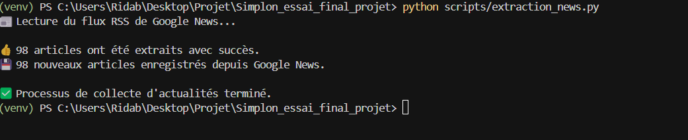

# Rapport d'Épreuve E1 : Construction du Pipeline de Données (C1-C5)

**Candidat** : Rida Boualam
**Projet** : Bitcoin Analyzer
**Date** : Juillet 2025
**Certification Visée** : RNCP37827 - Développeur en Intelligence Artificielle

## Table des Matières

*   Introduction : Bâtir la Fondation d'un Service d'IA
    *   1.1. Contexte et Vision du Projet
    *   1.2. Objectifs de l'Épreuve E1 : Valider le Bloc 1
*   La Stratégie de Collecte Multi-Sources
    *   2.1. C1 - Source 1 : L'API Financière Coinalyze pour la Fiabilité des Données de Marché
    *   2.2. C1 & C21 - Source 2 : La Collecte d'Actualités, un Cas d'École en Résolution d'Incident
        *   2.2.1. L'Approche Initiale : Preuve de Concept avec le Scraping Dynamique
        *   2.2.2. L'Incident Technique : La Fragilité d'une Solution Ad-Hoc
        *   2.2.3. La Résolution Stratégique : Pivot vers un Standard Industriel (Flux RSS)
    *   2.3. C2 - Source 3 : Intégration d'un Système Existant via SQL
*   C4 : Modélisation et Stockage, le Garant de l'Intégrité des Données
    *   3.1. Le Choix de la Base de Données : Pragmatisme et Évolutivité
    *   3.2. Un Schéma Conçu pour la Robustesse et l'Idempotence
*   C5 : Exposition des Données via une API REST Professionnelle
    *   4.1. FastAPI : Le Choix de la Performance et de la Documentation
    *   4.2. Preuve de Fonctionnalité : L'Interface Interactive Swagger UI
*   Conclusion de l'Épreuve E1 : Un Socle Fiable Prêt pour l'IA

# 1. Introduction : Bâtir la Fondation d'un Service d'IA

## 1.1. Contexte et Vision du Projet

Le projet "**Bitcoin Analyzer**" a pour ambition de démystifier le marché du Bitcoin pour un public non-spécialiste. Face à un écosystème d'informations fragmenté et souvent technique, l'objectif est de créer un service qui centralise les données clés et fournit des analyses claires. La première étape, et la plus fondamentale, est la construction d'un pipeline de données capable d'agréger des informations de natures diverses de manière fiable, continue et automatisée. C'est le socle sur lequel reposera toute la valeur ajoutée de l'intelligence artificielle.

## 1.2. Objectifs de l'Épreuve E1 : Valider le Bloc 1

Ce premier rapport documente la mise en place de cette fondation. Il vise à valider l'ensemble des compétences du Bloc 1 du référentiel RNCP37827, en démontrant ma capacité à :

*   Collecter des données depuis au moins trois sources hétérogènes (API, Web, SQL) (C1, C2).
*   Stocker ces informations de manière structurée et pérenne, en garantissant leur intégrité (C4).
*   Exposer les données de manière standardisée et professionnelle via une API REST (C5).

# 2. La Stratégie de Collecte Multi-Sources

Conformément aux exigences, j'ai mis en place une chaîne de collecte s'appuyant sur trois sources distinctes pour assurer une couverture complète de l'information.

## 2.1. C1 - Source 1 : L'API Financière Coinalyze pour la Fiabilité des Données de Marché

Pour les données de marché (prix, volume), la précision est non négociable. Mon choix s'est donc porté sur une API professionnelle, **Coinalyze**, réputée pour la qualité de ses données.

*Implémentation Technique (scripts/extraction_api.py)*

Le script d'extraction utilise la bibliothèque `requests` pour interroger le service. La sécurité a été une priorité : la clé d'API est stockée dans un fichier `.env` (exclu du versionnement via `.gitignore`) et chargée en mémoire à l'exécution avec `python-dotenv`. Cette approche permet de partager le code source en toute sécurité. Une gestion des erreurs robuste vérifie le code de statut de la réponse HTTP pour s'assurer que seules les données valides sont traitées.

*Extrait de scripts/extraction_api.py :*

```python
# Fichier: scripts/extraction_api.py
from dotenv import load_dotenv
import os
import requests

load_dotenv() # Charge les variables d'environnement
API_KEY = os.getenv("COINALYZE_API")

def get_bitcoin_data():
    headers = {"api_key": API_KEY}
    # ... construction des paramètres ...
    response = requests.get(API_URL, headers=headers, params=params)
    if response.status_code == 200:
        return response.json()
    else:
        print(f"Erreur lors de l'appel à l'API Coinalyze : {response.status_code}")
        return None
```

## 2.2. C1 & C21 - Source 2 : La Collecte d'Actualités, un Cas d'École en Résolution d'Incident

La collecte des actualités a été une excellente opportunité de démontrer non seulement une compétence technique avancée, mais aussi une capacité à résoudre un incident de manière stratégique (C21).

### 2.2.1. L'Approche Initiale : Preuve de Concept avec le Scraping Dynamique

Initialement, pour prouver ma capacité à gérer des scénarios de collecte complexes, j'ai développé un scraper pour le site **news.bitcoin.com**, qui charge son contenu via JavaScript. La solution, utilisant **undetected-chromedriver**, pilotait un navigateur Chrome pour attendre le rendu complet de la page avant de parser le HTML avec **BeautifulSoup**. Cette approche a fonctionné et a permis de valider la faisabilité technique.

### 2.2.2. L'Incident Technique : La Fragilité d'une Solution Ad-Hoc

Après plusieurs jours, le script a commencé à échouer de manière imprévisible. Les logs montraient des erreurs **HTTP 403: Forbidden** et des pages de vérification **Captcha**, indiquant que le site avait renforcé ses protections anti-bot.

### 2.2.3. La Résolution Stratégique : Pivot vers un Standard Industriel (Flux RSS)

Face à cet incident, j'ai diagnostiqué que s'obstiner à contourner ces protections serait une "course à l'armement" coûteuse en maintenance et fondamentalement peu fiable pour un service de production.

La meilleure solution n'était pas une escalade technique, mais un pivot stratégique.

J'ai donc pris la décision d'abandonner le scraping au profit d'une source de données conçue pour l'échange automatisé : les **flux RSS**. Le script `scripts/extraction_news.py` a été entièrement réécrit pour utiliser la bibliothèque **feedparser** et cibler le flux RSS de **Google News**. Cette approche est infiniment plus robuste, car elle s'appuie sur un protocole standardisé (XML), garantissant la pérennité, la fiabilité et la simplicité de la collecte.

*Leçon Apprise* : Cet incident a été une leçon pratique fondamentale. Une solution robuste n'est pas la plus complexe techniquement, mais la plus stable. Savoir abandonner une approche fragile pour une solution standard est une compétence d'ingénieur clé.

*Extrait du nouveau script scripts/extraction_news.py :*

```python
# Fichier: scripts/extraction_news.py
import feedparser

RSS_URL = "https://news.google.com/rss/search?q=Bitcoin&hl=fr&gl=FR&ceid=FR:fr"

def extract_news_from_rss():
    print("Lecture du flux RSS de Google News...")
    feed = feedparser.parse(RSS_URL)
    articles = []
    for entry in feed.entries:
        articles.append({'title': entry.title, 'link': entry.link})
    return articles
```


*Figure 1 : Exécution réussie du script de collecte basé sur le flux RSS, démontrant la robustesse de la nouvelle solution.*

## 2.3. C2 - Source 3 : Intégration d'un Système Existant via SQL

Pour simuler l'intégration avec une base de données d'entreprise existante, j'ai créé une base "legacy" (`source_data.db`). Le script `scripts/extraction_sql.py` se connecte à cette base et utilise une requête `SELECT` standard pour en extraire des articles. Cela démontre la maîtrise fondamentale de l'interaction avec des SGBD via le langage SQL.

*Extrait de scripts/extraction_sql.py :*

```python
# Fichier: scripts/extraction_sql.py
import sqlite3

source_conn = sqlite3.connect("data/source_data.db")
source_cursor = source_conn.cursor()

query = "SELECT article_title, article_url FROM legacy_articles;"
source_cursor.execute(query)
articles_from_source = source_cursor.fetchall()
source_conn.close()
```

# 3. C4 : Modélisation et Stockage, le Garant de l'Intégrité des Données

## 3.1. Le Choix de la Base de Données : Pragmatisme et Évolutivité

Pour la phase de développement, j'ai choisi **SQLite**. Sa simplicité (un simple fichier), son absence de serveur et son intégration native à Python ont permis d'accélérer le développement et de simplifier radicalement l'environnement de test. L'architecture modulaire du projet permet une migration future vers un SGBD plus robuste comme **PostgreSQL** sans refonte majeure.

## 3.2. Un Schéma Conçu pour la Robustesse et l'Idempotence

La conception du schéma de la base de données (`scripts/stockage.py`) a été guidée par un principe clé : **garantir l'intégrité des données**. Pour ce faire, j'ai ajouté une contrainte `UNIQUE` sur les champs `timestamp` (pour les prix) et `title` (pour les actualités).

Cette contrainte rend les scripts de collecte **idempotents** : je peux les exécuter à plusieurs reprises, et seuls les nouveaux enregistrements seront insérés. Les doublons sont automatiquement ignorés, empêchant la pollution du jeu de données et garantissant sa fiabilité à long terme.

*Extrait du Schéma SQL :*

```sql
CREATE TABLE IF NOT EXISTS bitcoin_prices (
    id INTEGER PRIMARY KEY AUTOINCREMENT,
    timestamp INTEGER UNIQUE, -- Empêche les doublons de prix
    -- ... autres colonnes ...
);

CREATE TABLE IF NOT EXISTS bitcoin_news (
    id INTEGER PRIMARY KEY AUTOINCREMENT,
    title TEXT NOT NULL UNIQUE, -- Empêche les doublons d'articles
    -- ... autres colonnes ...
);
```

# 4. C5 : Exposition des Données via une API REST Professionnelle

## 4.1. FastAPI : Le Choix de la Performance et de la Documentation

Pour exposer les données, j'ai développé une API REST avec **FastAPI**. Ce choix a été motivé par sa haute performance et, surtout, par sa capacité à générer automatiquement une documentation interactive **Swagger UI** conforme au standard **OpenAPI**. Cela garantit que l'API est non seulement fonctionnelle mais aussi professionnelle et facile à utiliser pour d'autres développeurs.

## 4.2. Preuve de Fonctionnalité : L'Interface Interactive Swagger UI

La preuve la plus tangible de la réussite de cette compétence est l'interface web générée par FastAPI. En se connectant à l'URL `/docs`, on accède à un tableau de bord complet qui liste tous les endpoints, détaille leurs paramètres, et permet de les tester en direct. C'est la démonstration concrète d'une API livrée de manière professionnelle.

*Figure 2 & 3 : Interface Swagger UI générée par FastAPI, prouvant la fonctionnalité et la documentation des endpoints.*


# 5. Conclusion de l'Épreuve E1 : Un Socle Fiable Prêt pour l'IA

À l'issue de cette première épreuve, la fondation du projet est solide. Un pipeline de données automatisé collecte, nettoie et stocke des informations depuis trois sources distinctes, en démontrant une capacité à surmonter des défis techniques réels comme la fragilité du web scraping. Les données sont stockées de manière fiable et sont prêtes à être consommées via une API rapide et bien documentée. Le socle technique est maintenant prêt pour la phase suivante : l'enrichir avec l'intelligence artificielle.