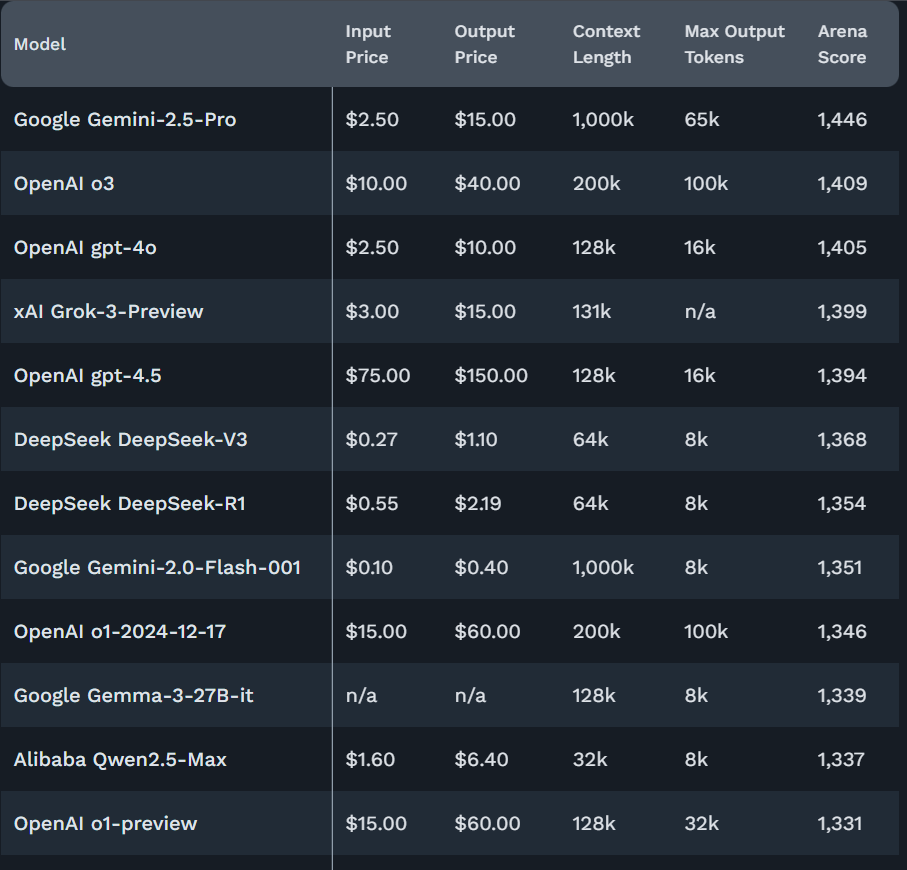

# Rapport d'Épreuve E2 : Veille, Sélection et Paramétrage du Service d'Intelligence Artificielle (C6-C8)

**Projet** : Bitcoin Analyzer
**Candidat** : Rida Boualam
**Date** : Juillet 2025
**Certification Visée** : RNCP37827 - Développeur en Intelligence Artificielle

## Table des Matières

1.  Introduction : La Dimension Stratégique du Choix Technologique
    1.1. Contexte et Enjeux
    1.2. Structure du Rapport
2.  C6 : Ma Stratégie de Veille Technologique : Rester Pertinent dans un Monde en Mouvement
    2.1. Philosophie de Veille : Le Pragmmatisme avant la Théorie
    2.2. Méthodologie et Sources Actives
    2.3. Cas Pratiques de Veille : Des Outils qui Changent la Manière de Travailler
        2.3.1. Repomix : Donner le Contexte Complet à l'IA
        2.3.2. Gemini CLI : Intégrer l'IA dans le Terminal
3.  C7 : Benchmark et Sélection du Modèle d'IA : une Décision Basée sur les Faits
    3.1. Le Choix d'une Source de Vérité : Le Classement LMSys
    3.2. Étape 1 : Analyse des Performances Générales (Arena Overview)
    3.3. Étape 2 : Validation sur un Cas d'Usage Spécialisé (WebDev Arena)
    3.4. Étape 3 : Analyse Comparative : Performance, Coût et Capacités Architecturales
    3.5. Décision Finale et Stratégie d'Implémentation
4.  C8 : Paramétrage Sécurisé du Service : la Base de la Confiance
    4.1. Le Risque d'une Clé d'API Exposée
    4.2. Ma Méthode de Sécurisation
    4.3. Preuve de l'Implémentation
5.  Conclusion de l'Épreuve E2
6.  Annexe A : Code Source du Module d'Analyse

## 1. Introduction : La Dimension Stratégique du Choix Technologique

### 1.1. Contexte et Enjeux

Pour construire une application IA performante aujourd'hui, il ne suffit pas de savoir coder. Il faut savoir choisir les bons outils dans un écosystème qui change toutes les semaines. Un mauvais choix au départ peut avoir des conséquences critiques plus tard : un modèle trop lent peut ruiner l'expérience utilisateur, un modèle trop cher peut rendre le projet non viable, et un modèle peu performant peut fournir des analyses incorrectes, discréditant toute l'application.

Ce rapport explique la démarche très concrète que j'ai suivie pour le projet "**Bitcoin Analyzer**". Loin d'une approche théorique, j'ai basé mon travail sur trois piliers pragmatiques :

*   Une veille technologique active (**C6**), en observant ce que la communauté des développeurs construit et utilise réellement, pour éviter les "technologies miracles" qui ne sont en fait pas encore matures.
*   Un benchmark rigoureux (**C7**), en m'appuyant sur des données publiques et respectées pour comparer les meilleurs modèles d'IA et prendre une décision basée sur des faits, pas sur du marketing.
*   Un paramétrage sécurisé (**C8**), en appliquant les règles de base pour protéger mes outils et mes clés, car la sécurité est un prérequis non négociable.

### 1.2. Structure du Rapport

Ce document n'est pas une liste de faits, mais le récit d'une décision d'ingénieur. Il détaille d'abord ma méthode de veille personnelle, puis expose l'analyse comparative qui m'a mené au choix du modèle, et se termine par la description de son intégration sécurisée. L'objectif est de démontrer que le choix de la famille de modèles **Google Gemini** comme moteur de mon application est le résultat d'un processus réfléchi et professionnel.

## 2. C6 : Ma Stratégie de Veille Technologique : Rester Pertinent dans un Monde en Mouvement

### 2.1. Philosophie de Veille : Le Pragmmatisme avant la Théorie

Pour rester pertinent, je me concentre sur des sources dynamiques qui me montrent ce qui est non seulement nouveau, mais aussi utile et adopté par la communauté. Ma philosophie est simple : une technologie n'a de la valeur que si elle est utilisée par les développeurs pour résoudre de vrais problèmes.

### 2.2. Méthodologie et Sources Actives

Ma veille s'articule autour de deux sources principales qui se complètent :

*   **GitHub Trending** (ma source principale) : Je consulte cette page quotidiennement. C'est le meilleur moyen de voir ce que la communauté internationale des développeurs est en train de construire et d'adopter. C'est un indicateur de pertinence technique bien plus fiable que les annonces marketing.
*   Les **Créateurs de Contenu Techniques sur YouTube** : Je suis plusieurs chaînes spécialisées qui font un excellent travail de vulgarisation et de test des nouvelles technologies. Ils me font gagner un temps précieux en synthétisant les annonces majeures et en montrant des exemples concrets.

### 2.3. Cas Pratiques de Veille : Des Outils qui Changent la Manière de Travailler

Ma veille n'est pas passive ; elle alimente directement ma manière de travailler. Voici deux exemples concrets d'outils que j'ai découverts et analysés grâce à cette méthode, et qui ont eu un impact sur mon flux de travail pour ce projet.

#### 2.3.1. Repomix : Donner le Contexte Complet à l'IA


Figure 1 : Page du projet Repomix, un outil découvert lors de ma veille sur GitHub.

À quoi ça sert ? **Repomix** est un outil qui analyse une base de code complète et la fusionne en un seul fichier texte (Markdown ou XML). Son utilité est brillante : il rend un projet entier "lisible" par une IA.

Mon intérêt et l'impact sur mon travail : Pour le *débuggage assisté par IA*, c'est un changement majeur. Avant, je devais copier-coller des petits bouts de code et expliquer le contexte à un LLM. Avec **Repomix**, je peux lui fournir l'intégralité de mon projet. Cela permet de poser des questions beaucoup plus complexes sur l'architecture ou des bugs difficiles à tracer. C'est un gain de productivité énorme.

#### 2.3.2. Gemini CLI : Intégrer l'IA dans le Terminal


Figure 2 : Le projet Gemini CLI, un assistant IA directement intégré au terminal.

À quoi ça sert ? C'est un assistant de codage qui fonctionne directement dans le *terminal*, un peu comme une version en ligne de commande de **Copilot** ou **Cursor**.

Mon intérêt et l'impact sur mon travail : Son avantage est l'immédiateté. Quand je code et que j'ai une question rapide ou que je veux tester un prompt, je n'ai pas besoin de quitter mon *terminal*. Je peux directement demander à **Gemini** de m'expliquer une ligne de code ou de générer une fonction. C'est beaucoup plus efficace pour des tests rapides que d'écrire un script Python temporaire.

## 3. C7 : Benchmark et Sélection du Modèle d'IA : une Décision Basée sur les Faits

### 3.1. Le Choix d'une Source de Vérité : Le Classement LMSys

Pour choisir le LLM, j'ai écarté les brochures marketing et je me suis basé sur une seule source de données : le **LMSys Chatbot Arena Leaderboard**. C'est un projet de recherche universitaire qui classe les modèles en se basant sur un système de score Elo, alimenté par des centaines de milliers de comparaisons en aveugle faites par des humains. C'est la source la plus objective pour mesurer la performance réelle des modèles.

### 3.2. Étape 1 : Analyse des Performances Générales (Arena Overview)

La première étape a été d'identifier les leaders sur l'ensemble des tâches.


Figure 3 : Classement général LMArena. Gemini-2.5-Pro domine dans toutes les catégories principales.

L'analyse de ce tableau est immédiate. Le modèle **gemini-2.5-pro** de Google se classe numéro 1 sur toutes les catégories les plus importantes : performance générale, gestion de prompts complexes, et même le codage. Cette polyvalence et cette domination en font le candidat de référence.

### 3.3. Étape 2 : Validation sur un Cas d'Usage Spécialisé (WebDev Arena)

Pour confirmer ce premier résultat, j'ai regardé ses performances sur une tâche qui demande de la logique et de la structure : le développement web.


Figure 4 : Classement LMArena pour le cas d'usage spécialisé "WebDev". Gemini-2.5-Pro est également classé numéro 1.

Le résultat confirme la tendance : **Gemini-2.5-Pro** est également classé numéro 1 sur ce cas d'usage spécialisé. Cela m'a donné la certitude que ce modèle était non seulement un excellent généraliste, mais aussi un outil performant pour des applications professionnelles exigeantes.

## 3.4. Étape 3 : Analyse Comparative : Performance, Coût et Capacités Architecturales

La performance est le critère principal, mais elle doit être mise en balance avec le coût et les capacités techniques, notamment la "fenêtre de contexte" (la quantité d'information que le modèle peut traiter en une seule fois). L'analyse suivante se base sur les données précises que j'ai collectées.


*Figure 5 : Tableau comparatif des principaux modèles du marché, incluant prix et fenêtre de contexte, basé sur mes recherches.*

Ci-dessous, j'ai décomposé l'analyse pour chaque concurrent majeur visible sur ce tableau, afin de justifier ma décision finale de manière factuelle.

### Analyse Détaillée des Modèles (Basée sur la Figure 5)

#### Google Gemini (gemini-2.5-pro)

*   **Performance (Score Arena)**: 1,446. C'est le leader incontesté du classement, garantissant la meilleure qualité d'analyse possible.
*   **Coût ($/Mtokens)**: $2.50 (Input) / $15.00 (Output). Une tarification compétitive pour le modèle le plus performant.
*   **Fenêtre de Contexte**: 1,000k tokens. C'est son avantage stratégique décisif. Cette capacité à traiter un million de tokens ouvre la porte à des analyses futures très complexes (ex: analyser des dizaines de documents en une seule fois), ce qu'aucun concurrent direct ne peut faire.
*   **Analyse Stratégique**: Le meilleur choix global. Il combine la meilleure performance avec des capacités techniques supérieures et un prix justifié. C'est le choix de la qualité et de l'évolutivité.

#### OpenAI (o3)

*   **Performance (Score Arena)**: 1,409. Très performant, il est le concurrent le plus sérieux de Gemini, mais reste statistiquement en retrait.
*   **Coût ($/Mtokens)**: $10.00 (Input) / $40.00 (Output). Le coût est 4 fois plus élevé en input que celui de Gemini, le rendant non viable économiquement pour un projet comme le mien.
*   **Fenêtre de Contexte**: 200k tokens. C'est 5 fois plus petit que Gemini, ce qui limite fortement les cas d'usage avancés.
*   **Analyse Stratégique**: Écarté principalement à cause de son coût prohibitif, qui n'est pas justifié par sa performance légèrement inférieure et sa fenêtre de contexte beaucoup plus faible.

#### OpenAI (gpt-4o)

*   **Performance (Score Arena)**: 1,405. Un modèle solide, mais clairement un cran en dessous du leader.
*   **Coût ($/Mtokens)**: $2.50 (Input) / $10.00 (Output). Le coût d'input est identique à Gemini, ce qui est attractif.
*   **Fenêtre de Contexte**: 128k tokens. C'est son plus grand défaut. Une fenêtre de contexte près de 8 fois inférieure à celle de Gemini est un frein majeur pour l'évolutivité du projet.
*   **Analyse Stratégique**: Un bon compromis prix/performance pour des tâches simples, mais sa faible fenêtre de contexte est un facteur bloquant pour les ambitions futures du projet.

#### Grok (xAI Grok-3-Preview)

*   **Performance (Score Arena)**: 1,399. Une performance inférieure aux autres.
*   **Coût ($/Mtokens)**: $3.00 (Input) / $15.00 (Output). Une tarification compétitive.
*   **Fenêtre de Contexte**: 128k tokens. Identique à gpt-4o et donc très limitée.
*   **Analyse Stratégique**: Bon compromis mais faible taille de contexte dû aux 128k tokens.


## 3.5. Décision Finale et Stratégie d'Implémentation

**Décision**: Le choix stratégique est la famille de modèles Google Gemini.

L'analyse comparative, basée sur les données les plus récentes, est sans équivoque. Le modèle `gemini-2.5-pro` est le seul à cocher toutes les cases : il est classé numéro 1 en performance, il possède de loin la plus grande fenêtre de contexte (un avantage stratégique majeur pour l'avenir), et sa tarification reste compétitive face à ses concurrents directs.

Pour la version actuelle du projet, j'utilise le modèle standard et plus économique 'gemini-flash'. Cependant, j'ai conçu mon code de manière à ce que le passage au modèle supérieur 'gemini-2.5-pro' ne nécessite de changer qu'une seule ligne de code, ce qui garantit l'évolutivité future du projet.

## 4. C8 : Paramétrage Sécurisé du Service : la Base de la Confiance

### 4.1. Le Risque d'une Clé d'API Exposée

Une clé d'API qui fuite sur un dépôt GitHub public peut être trouvée par des bots en quelques secondes et entraîner une facturation de plusieurs milliers d'euros en quelques heures. La gestion sécurisée des clés est donc une règle non négociable.

### 4.2. Ma Méthode de Sécurisation

Pour ce projet, j'ai appliqué la méthode standard et efficace :

*   La clé d'API est stockée dans un fichier `.env`.
*   Ce fichier est ajouté au `.gitignore` pour ne jamais être envoyé sur GitHub.
*   Mon code utilise la bibliothèque `python-dotenv` pour charger la clé en mémoire.

### 4.3. Preuve de l'Implémentation

Le code ci-dessous montre comment cette méthode est mise en pratique. La clé est chargée au démarrage et utilisée pour configurer le service, mais elle n'apparaît jamais en clair dans le code source.

*Extrait de scripts/llm_analyzer.py : la méthode de configuration sécurisée.*

```python
# Fichier: scripts/llm_analyzer.py
import os
from dotenv import load_dotenv
import google.generativeai as genai

# Je charge les variables d'environnement depuis le fichier .env
load_dotenv()
GEMINI_API_KEY = os.getenv("GEMINI_API_KEY")

def analyze_text(prompt):
    # La clé est utilisée ici, mais elle n'est jamais visible dans le code
    genai.configure(api_key=GEMINI_API_KEY)
    
    # J'utilise le modèle standard, mais le code est prêt à basculer
    # vers 'gemini-2.5-pro' si besoin.
    model = genai.GenerativeModel('gemini-pro')
    
    response = model.generate_content(prompt)
    return response.text
```

## 5. Conclusion de l'Épreuve E2

Ce rapport a détaillé ma démarche pragmatique pour choisir le cœur intelligent du projet. En partant de ma propre veille sur les tendances de la communauté des développeurs et en validant mes hypothèses avec les données objectives du classement LMSys, j'ai pu justifier solidement le choix de la famille de modèles Google Gemini. Cette approche, qui va de la découverte à la décision basée sur les faits, est au cœur de ma vision du métier de développeur en IA.

## 6. Annexe A : Code Source du Module d'Analyse

Pour référence, voici le code complet du module `scripts/llm_analyzer.py` tel qu'utilisé dans le projet.

```python
# Fichier: scripts/llm_analyzer.py

import os
from dotenv import load_dotenv
import google.generativeai as genai

# Étape 1 : Charger les variables d'environnement
# Cette ligne lit le fichier .env et rend les variables disponibles
# comme des variables d'environnement système pour ce script.
load_dotenv()

# Étape 2 : Récupérer la clé d'API de manière sécurisée
# os.getenv() lit la variable d'environnement. Si elle n'existe pas,
# la variable GEMINI_API_KEY sera None, ce qui provoquera une erreur
# plus tard, indiquant un problème de configuration.
GEMINI_API_KEY = os.getenv("GEMINI_API_KEY")

def analyze_text(prompt):
    """
    Analyse un prompt textuel en utilisant le service Google Gemini.
    
    Args:
        prompt (str): Le texte à analyser.
        
    Returns:
        str: La réponse textuelle générée par le modèle.
    """
    
    # Étape 3 : Configuration du service Gemini
    # Cette étape est cruciale et doit être faite avant tout appel.
    # Elle utilise la clé chargée pour authentifier les futures requêtes.
    genai.configure(api_key=GEMINI_API_KEY)
    
    # Étape 4 : Sélection et instanciation du modèle
    # Le nom du modèle ('gemini-pro') est spécifié ici.
    # C'est cette ligne qu'il faudrait modifier pour passer à un modèle
    # plus puissant comme 'gemini-2.5-pro'.
    model = genai.GenerativeModel('gemini-pro')
    
    # Étape 5 : Appel à l'API pour générer le contenu
    # Le prompt est envoyé au modèle.
    response = model.generate_content(prompt)
    
    # Étape 6 : Retourner le résultat
    # La réponse de l'API est un objet complexe, mais la partie
    # qui nous intéresse est le texte généré, accessible via .text.
    return response.text

# Bloc de test pour une exécution directe du script (facultatif mais utile pour le debug)
if __name__ == "__main__":
    test_prompt = "Quelle est la tendance du Bitcoin aujourd'hui ?"
    print(f"Envoi du prompt de test : '{test_prompt}'")
    
    try:
        analysis = analyze_text(test_prompt)
        print("\nRéponse de l'IA :")
        print(analysis)
    except Exception as e:
        print(f"\nUne erreur est survenue : {e}")
        print("Veuillez vérifier que votre clé GEMINI_API_KEY est bien configurée dans le fichier .env")
```