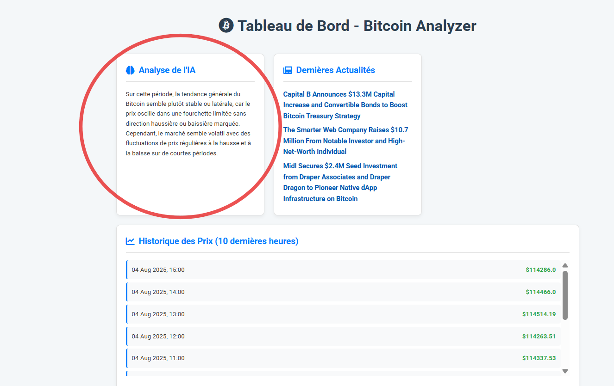
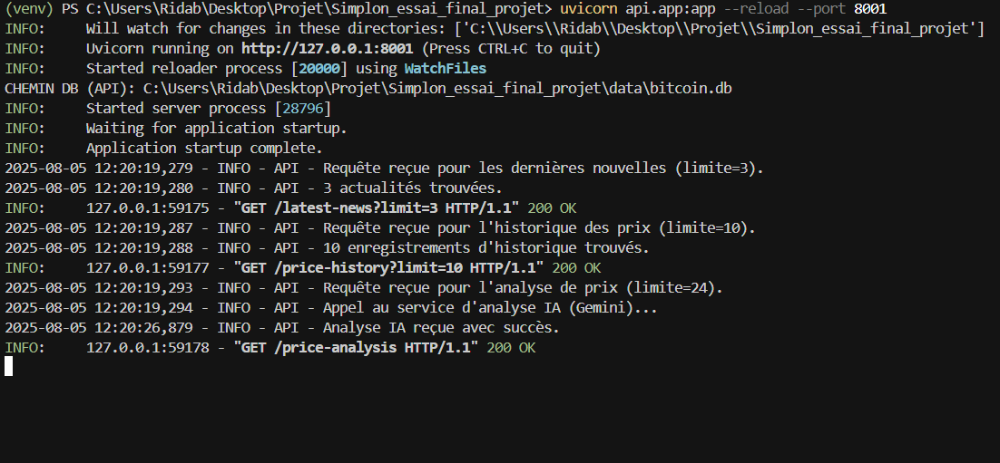
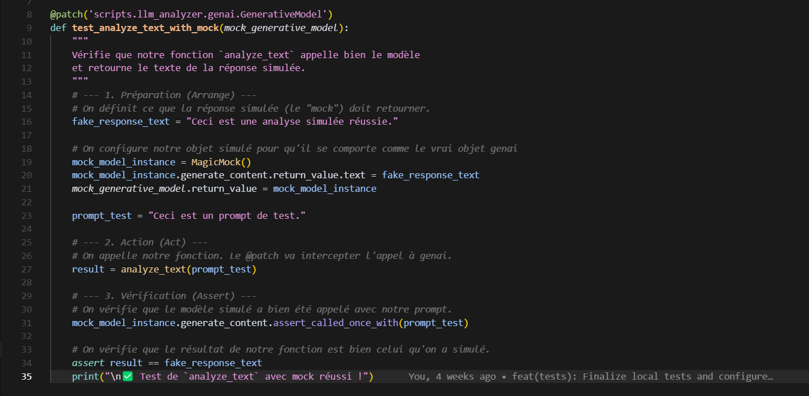
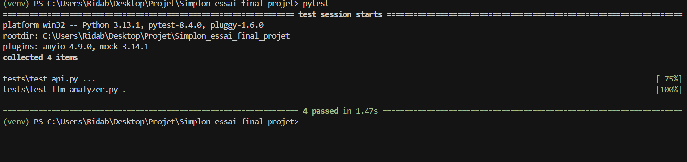
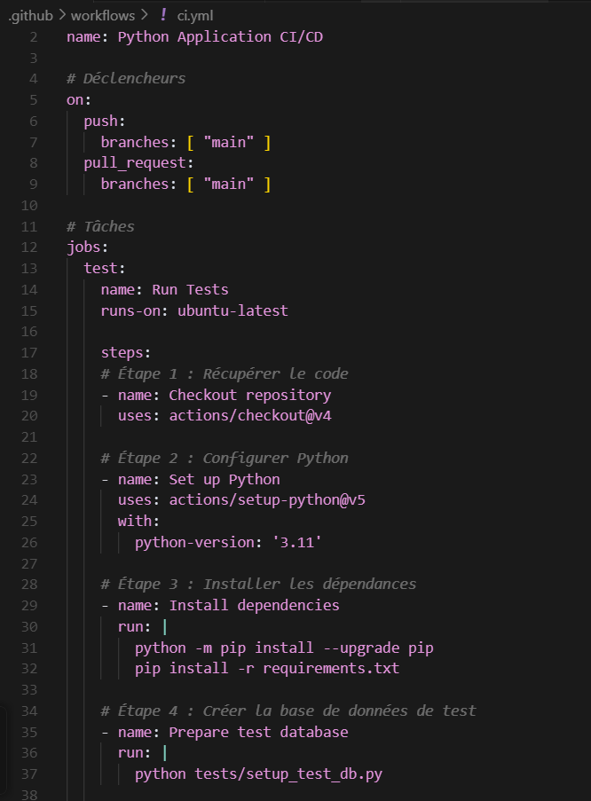
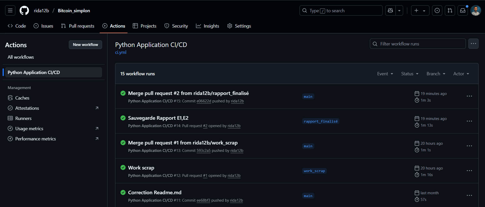

# Rapport d'Épreuve E3 : Intégration et Déploiement du Service d'IA (C9-C13)

Projet : **Bitcoin Analyzer**
Candidat : Rida Boualam
Date : Juillet 2025
Certification Visée : RNCP37827 - Développeur en Intelligence Artificielle

## Table des Matières

*   [Introduction : De l'Idée au Service Fiable](#1-introduction--de-lidee-au-service-fiable)
    *   [1.1. Contexte de l'Épreuve](#11-contexte-de-lepreuve)
    *   [1.2. L'Approche MLOps : La Rigueur du Logiciel Appliquée à l'IA](#12-lapproche-mlops--la-rigueur-du-logiciel-appliquee-a-lia)
*   [C9 : Exposer le Modèle d'IA via une API : L'Art du "Prompt Engineering"](#2-c9--exposer-le-modele-dia-via-une-api--lart-du-prompt-engineering)
    *   [2.1. Le Rôle Stratégique de l'Endpoint /price-analysis](#21-le-role-strategique-de-lendpoint-price-analysis)
    *   [2.2. Ma Stratégie de Prompt Engineering en 4 Étapes](#22-ma-strategie-de-prompt-engineering-en-4-etapes)
    *   [2.3. Analyse de l'Implémentation dans le Code](#23-analyse-de-limplementation-dans-le-code)
*   [C10 : Intégrer l'API dans une Application Externe](#3-c10--integrer-lapi-dans-une-application-externe)
    *   [3.1. L'Architecture Client-Serveur Découplée](#31-larchitecture-client-serveur-decouplee)
    *   [3.2. L'Appel depuis le Frontend Django : Preuve de l'Intégration](#32-lappel-depuis-le-frontend-django--preuve-de-lintegration)
*   [C11 : Monitorer le Modèle pour Assurer la Fiabilité](#4-c11--monitorer-le-modele-pour-assurer-la-fiabilite)
    *   [4.1. L'Importance Cruciale de la Journalisation (Logging)](#41-limportance-cruciale-de-la-journalisation-logging)
    *   [4.2. Ma Stratégie de Logging Détaillée dans l'API](#42-ma-strategie-de-logging-detaillee-dans-lapi)
    *   [4.3. Preuve de Monitoring : Analyse d'un Log Réel](#43-preuve-de-monitoring--analyse-dun-log-reel)
*   [C12 : Tester l'IA sans se Ruiner : la Puissance du Mocking](#5-c12--tester-lia-sans-se-ruiner--la-puissance-du-mocking)
    *   [5.1. Le Problème : Comment Tester une API Externe et Payante ?](#51-le-probleme--comment-tester-une-api-externe-et-payante)
    *   [5.2. La Solution d'Ingénierie : Isoler le Code avec le Mocking](#52-la-solution-dingenierie--isoler-le-code-avec-le-mocking)
    *   [5.3. Preuve et Analyse de l'Implémentation des Tests](#53-preuve-et-analyse-de-limplementation-des-tests)
*   [C13 : Créer une Chaîne de Livraison Continue (CI/CD) : le Filet de Sécurité Automatisé](#6-c13--creer-une-chaine-de-livraison-continue-cicd--le-filet-de-securite-automatise)
    *   [6.1. La Philosophie de l'Intégration Continue](#61-la-philosophie-de-lintegration-continue)
    *   [6.2. Mon Workflow GitHub Actions Expliqué](#62-mon-workflow-github-actions-explique)
    *   [6.3. Preuve de Validation Automatisée : Analyse de l'Exécution](#63-preuve-de-validation-automatisee--analyse-de-lexecution)
*   [Conclusion de l'Épreuve E3](#7-conclusion-de-lepreuve-e3)
*   [Annexes](#8-annexes)
    *   [Annexe A : Code Source du Test du Module d'IA (test_llm_analyzer.py)](#annexe-a--code-source-du-test-du-module-dia-test_llm_analyzerpy)
    *   [Annexe B : Code Source du Workflow CI/CD (ci.yml)](#annexe-b--code-source-du-workflow-cicd-ciyml)

---

## 1. Introduction : De l'Idée au Service Fiable

### 1.1. Contexte de l'Épreuve

Après avoir mis en place un pipeline de données fiable (Épreuve E1) et avoir sélectionné le meilleur modèle d'IA pour mon besoin (Épreuve E2), le défi suivant est de transformer ce modèle en un service concret, robuste et utilisable. Avoir un bon modèle ne sert à rien s'il n'est pas accessible, s'il n'est pas fiable, ou si chaque mise à jour risque de tout casser.

### 1.2. L'Approche MLOps : La Rigueur du Logiciel Appliquée à l'IA

Cette épreuve couvre le cœur des pratiques **MLOps** (Machine Learning Operations). L'objectif est de traiter le code de l'IA avec la même rigueur que n'importe quel autre logiciel en production. Pour cela, j'ai mis en place un cycle complet :

*   Exposer le modèle via une API (**C9**).
*   Intégrer cette API dans une application (**C10**).
*   Monitorer son fonctionnement pour détecter les problèmes (**C11**).
*   Tester son comportement de manière automatisée (**C12**).
*   Valider automatiquement chaque modification avec une chaîne de **CI/CD** (**C13**).

---

## 2. C9 : Exposer le Modèle d'IA via une API : L'Art du "Prompt Engineering"

### 2.1. Le Rôle Stratégique de l'Endpoint `/price-analysis`

Pour que le modèle Gemini puisse être utilisé par d'autres applications, je l'ai exposé via un endpoint spécifique dans mon API FastAPI : `/price-analysis`. Le rôle de cet endpoint n'est pas seulement de transmettre une question à l'IA, mais de préparer soigneusement cette question pour obtenir la meilleure réponse possible. C'est une couche d'abstraction qui transforme une technologie brute (le LLM) en un service métier spécialisé (un analyste financier).

### 2.2. Ma Stratégie de Prompt Engineering en 4 Étapes

La qualité de la réponse d'un LLM dépend à 90% de la qualité du prompt qu'on lui envoie. J'ai donc appliqué une stratégie de "**prompt engineering**" directement dans mon code, en suivant 4 principes :

1.  **Donner un Rôle** : La première ligne du prompt est *Tu es un analyste financier pour un débutant*. Cela met l'IA dans le bon contexte (persona) et influence le ton, le vocabulaire et le niveau de technicité de sa réponse.
2.  **Fournir les Données** : Je récupère l'historique des prix depuis la base de données et je le formate en un texte simple et lisible. Je ne demande pas à l'IA de deviner, je lui fournis le contexte factuel sur lequel baser son analyse.
3.  **Poser une Question Claire** : Je lui demande explicitement d'identifier la tendance (haussière, baissière, stable) et la volatilité. Une question précise amène une réponse précise.
4.  **Contraindre le Format de Sortie** : Je lui précise de répondre en 2 phrases maximum pour garantir une analyse concise, directement utilisable dans l'interface utilisateur, sans avoir à la tronquer ou la reformater.

### 2.3. Analyse de l'Implémentation dans le Code

Voici comment cette stratégie est implémentée dans la fonction `price_analysis` de mon API. Chaque partie du prompt a un rôle bien défini.

*Extrait de `api/app.py` : la logique de l'endpoint d'analyse IA.*

```python
@app.get("/price-analysis", summary="Obtenir une analyse IA de la tendance des prix")
def price_analysis(limit: int = 24):
    logging.info(f"Requête reçue pour l'analyse de prix (limite={limit}).")
    try:
        # 1. Récupération des données depuis la BDD
        with sqlite3.connect(DB_PATH) as conn:
            # ... code de récupération des données ...
            rows = cursor.fetchall()

        if not rows:
            raise HTTPException(status_code=404, detail="Pas assez de données pour l'analyse")

        # 2. Formatage des données pour le prompt
        formatted_history = "\n".join(
            [f"Date (timestamp {row[0]}): Prix de clôture = {row[1]}$" for row in rows]
        )
        
        # 3. Construction du prompt structuré
        prompt = (
            "Tu es un analyste financier pour un débutant. "  # Le Rôle
            "Basé sur l'historique de prix du Bitcoin suivant, quelle est la tendance générale (haussière, baissière, ou stable) ? "  # La Question
            "Réponds en 2 phrases maximum, en mentionnant si le marché semble volatil ou non.\n\n"  # Les Contraintes
            f"Données:\n{formatted_history}"  # Les Données
        )

        # 4. Appel au service d'analyse IA
        analysis_result = analyze_text(prompt)

        return {"analysis": analysis_result}

    except Exception as e:
        raise HTTPException(status_code=500, detail="Erreur interne du serveur lors de l'analyse IA")
```
### 2.4. Preuve du Prompt et de la Réponse

Pour valider l'efficacité de cette stratégie, la capture d'écran ci-dessous montre le résultat final tel qu'affiché à l'utilisateur. On y voit une analyse concise et en langage simple, directement issue du prompt structuré envoyé à l'API. C'est la preuve que la technique de prompt engineering a fonctionné comme prévu.

*Figure 6 : Résultat de l'analyse générée par l'IA, affichée sur le tableau de bord final.*




---

## 3. C10 : Intégrer l'API dans une Application Externe

### 3.1. L'Architecture Client-Serveur Découplée

Mon projet est basé sur une architecture découplée, une pratique standard dans le développement moderne pour sa flexibilité et sa scalabilité :

*   Le backend FastAPI (sur le port 8001) agit comme un serveur qui fournit des données et des analyses.
*   Le frontend Django (sur le port 8000) agit comme un client qui consomme ces services pour les afficher à l'utilisateur.

### 3.2. L'Appel depuis le Frontend Django : Preuve de l'Intégration

La compétence **C10** est validée par la manière dont mon application Django interroge l'endpoint `/price-analysis`. Dans le fichier `viewer/views.py`, j'utilise la bibliothèque `requests` pour faire un appel HTTP standard, récupérer la réponse JSON et la transmettre au template. J'ai également inclus une gestion des erreurs avec un timeout pour que l'application ne reste pas bloquée si l'API est lente à répondre.

*Extrait de `viewer/views.py` : la consommation de l'API d'analyse.*

```python
# Fichier: viewer/views.py
import requests
API_BASE_URL = "http://127.0.0.1:8001"
def news_list(request):
    context = { ... }
    try:
        # ... autres appels API ...

        # Appel à l'endpoint d'analyse IA
        analysis_url = f"{API_BASE_URL}/price-analysis"
        analysis_response = requests.get(analysis_url, timeout=15)
        analysis_response.raise_for_status()
        context['price_analysis'] = analysis_response.json().get('analysis', "Format d'analyse inattendu.")

    except requests.exceptions.RequestException as e:
        # Gestion des erreurs de communication
        context['error_message'] = "Le service d'analyse est actuellement indisponible."

    return render(request, 'viewer/news_list.html', context)
```

---

## 4. C11 : Monitorer le Modèle pour Assurer la Fiabilité

### 4.1. L'Importance Cruciale de la Journalisation (Logging)

En production, on ne peut pas se contenter de "espérer que ça marche". Il faut pouvoir suivre ce qu'il se passe, diagnostiquer les erreurs et surveiller les performances. Pour cela, j'ai intégré le module `logging` de Python dans mon API.

### 4.2. Ma Stratégie de Logging Détaillée dans l'API

Chaque appel à l'endpoint `/price-analysis` est tracé. Je logue les informations critiques :

*   La réception de la requête.
*   Le début de l'appel à l'API externe de Gemini (pour mesurer la latence).
*   La réception réussie de la réponse.
*   Toute erreur qui pourrait survenir, avec sa trace complète pour faciliter le débuggage.

### 4.3. Preuve de Monitoring : Analyse d'un Log Réel

Le bloc de texte ci-dessous, extrait de `docs/exemples_de_logs.txt`, montre la trace exacte d'un appel réussi à l'API d'analyse. Ce n'est pas juste du texte, c'est une mine d'informations pour un ingénieur :

*   **Timestamp** (`2025-07-09 10:23:39,098`) : Permet de corréler les événements avec d'autres systèmes.
*   **Niveau de Log** (`INFO`) : Indique qu'il s'agit d'un événement normal.
*   **Message** : Décrit précisément l'action en cours.

En comparant le premier et le troisième timestamp, je peux calculer que l'appel à l'API Gemini et son analyse ont pris environ 7 secondes, une métrique de performance essentielle.

*Extrait de `docs/exemples_de_logs.txt` :*

```
2025-07-09 10:23:39,098 - INFO - API - Requête reçue pour l'analyse de prix (limite=24).
2025-07-09 10:23:39,103 - INFO - API - Appel au service d'analyse IA (Gemini)...
2025-07-09 10:23:46,068 - INFO - API - Analyse IA reçue avec succès.
INFO: 127.0.0.1:61446 - "GET /price-analysis HTTP/1.1" 200 OK
```
### 4.4. Visualisation des Logs en Temps Réel

En complément de l'analyse des fichiers de logs, la capture d'écran ci-dessous montre la sortie du serveur FastAPI en temps réel lors d'une requête utilisateur. On y voit distinctement les logs `INFO` qui tracent la réception de la requête, l'appel au service d'IA, et la réponse réussie. Cette journalisation en direct est un outil de débuggage indispensable au quotidien.

*Figure 7 : Logs du serveur FastAPI affichés en temps réel lors d'un appel à l'endpoint d'analyse.*



## 5. C12 : Tester l'IA sans se Ruiner : la Puissance du Mocking

### 5.1. Le Problème : Comment Tester une API Externe et Payante ?

Tester un composant qui dépend d'une API externe comme celle de Gemini pose un vrai problème :

*   **C'est lent** : Chaque test devrait attendre la réponse du réseau.
*   **C'est cher** : Chaque test effectuerait un vrai appel à l'API, ce qui serait facturé.
*   **Ce n'est pas fiable** : Le test pourrait échouer à cause d'un problème de connexion ou d'une indisponibilité de l'API de Gemini, et non à cause d'un bug dans mon code.

### 5.2. La Solution d'Ingénierie : Isoler le Code avec le Mocking

La solution professionnelle à ce problème est le **mocking**. Cela consiste à remplacer temporairement, juste pendant le test, l'appel réel à l'API externe par un "imitateur" (un mock) qui renvoie une réponse prévisible et contrôlée.

Pour cela, j'ai utilisé le décorateur `@patch` de la bibliothèque `unittest.mock` dans mon fichier de test `tests/test_llm_analyzer.py`.

### 5.3. Preuve et Analyse de l'Implémentation des Tests



*Figure 6 : Code du test unitaire pour le module d'analyse, utilisant le mocking pour isoler l'appel à l'API externe.*

L'analyse de ce code de test révèle une approche structurée :

1.  **`@patch(...)`** : Cette ligne est la clé. Elle dit à `pytest` : "Quand le code dans `scripts.llm_analyzer` essaiera d'appeler `genai.GenerativeModel`, intercepte cet appel et remplace-le par mon faux objet."
2.  **Préparation (Arrange)** : Je configure mon faux objet pour qu'il retourne une fausse réponse (`fake_response_text`) quand sa méthode `generate_content` est appelée.
3.  **Action (Act)** : J'appelle ma fonction `analyze_text` normalement.
4.  **Vérification (Assert)** : Je fais deux vérifications cruciales :
    *   `mock_model_instance.generate_content.assert_called_once_with(prompt_test)` : Je vérifie que ma fonction a bien essayé d'appeler l'API avec le bon prompt.
    *   `assert result == fake_response_text` : Je vérifie que ma fonction a bien retourné le texte de la fausse réponse.

Cette approche me permet d'exécuter des centaines de tests en quelques secondes, gratuitement et de manière 100% fiable.

### 5.4. Exécution et Validation des Tests

La preuve finale de l'efficacité de cette stratégie de test est son exécution. La capture d'écran ci-dessous montre le résultat de la commande `pytest` lancée depuis mon terminal. On y voit que la suite de tests, incluant `test_llm_analyzer.py` et les autres tests d'API, s'est exécutée avec succès. C'est la confirmation que ma logique métier, y compris celle qui interagit avec le service d'IA, est correcte et validée.

*Figure 8 : Résultat de l'exécution de la suite de tests `pytest`, montrant la validation réussie des composants.*




---

## 6. C13 : Créer une Chaîne de Livraison Continue (CI/CD) : le Filet de Sécurité Automatisé

### 6.1. La Philosophie de l'Intégration Continue

Pour automatiser ce processus de validation, j'ai mis en place une chaîne d'intégration continue avec GitHub Actions. L'objectif est simple : à chaque fois que je modifie le code, un robot doit automatiquement recréer l'environnement de zéro et vérifier que je n'ai rien cassé. C'est un filet de sécurité qui garantit la qualité et la non-régression du code.

### 6.2. Mon Workflow GitHub Actions

Le fichier `.github/workflows/ci.yml` définit les étapes de ce workflow. Il est conçu pour être simple et efficace. La capture d'écran ci-dessous montre son contenu.


*Figure 9 : Code source du workflow GitHub Actions défini dans `ci.yml`.*



### 6.3. Preuve de Validation Automatisée : Analyse de l'Exécution

La capture d'écran ci-dessous montre une exécution réussie de ce workflow sur GitHub. Ce n'est pas juste une image, c'est la preuve d'un processus MLOps fonctionnel. On y voit :
*   **Le Succès Global :** La coche verte ✅ en haut indique que l'intégralité du processus s'est déroulée sans erreur.
*   **La Séquence des Tâches :** On voit clairement chaque étape (`Install dependencies`, `Prepare test database`, `Run tests with pytest`) s'exécuter dans l'ordre et réussir individuellement.
*   **La Validation des Tests :** L'étape `Run tests with pytest` est celle qui exécute mes tests, y compris le test avec mocking. Sa réussite prouve que ma logique d'IA est valide.


*Figure 10 : Exécution réussie du workflow d'intégration continue sur GitHub Actions.*


---

## 7. Conclusion de l'Épreuve E3

À ce stade, le service d'IA du projet "Bitcoin Analyzer" est bien plus qu'un simple script. C'est un composant logiciel robuste, dont le fonctionnement est surveillé, dont la logique est validée par des tests automatisés, et dont la qualité est garantie à chaque modification par un pipeline de CI/CD. Cette approche MLOps garantit la fiabilité et la maintenabilité du cœur intelligent de l'application.

---

## 8. Annexes

### Annexe A : Code Source du Test du Module d'IA (`test_llm_analyzer.py`)

```python
# Fichier: tests/test_llm_analyzer.py
import pytest
from unittest.mock import patch, MagicMock
from scripts.llm_analyzer import analyze_text

# Le décorateur @patch intercepte tous les appels à 'genai.GenerativeModel'
# dans le module 'scripts.llm_analyzer' et le remplace par un mock.
@patch('scripts.llm_analyzer.genai.GenerativeModel')
def test_analyze_text_with_mock(mock_generative_model):
    """
    Vérifie que notre fonction `analyze_text` appelle bien le modèle simulé
    et retourne le texte de la réponse attendue.
    """
    # --- 1. Préparation (Arrange) ---
    # On définit ce que la réponse simulée (le "mock") doit retourner.
    fake_response_text = "Ceci est une analyse simulée réussie."
    
    # On configure notre objet simulé pour qu'il se comporte comme le vrai objet genai
    mock_model_instance = MagicMock()
    mock_model_instance.generate_content.return_value.text = fake_response_text
    mock_generative_model.return_value = mock_model_instance

    prompt_test = "Ceci est un prompt de test."

    # --- 2. Action (Act) ---
    # On appelle notre fonction. Le @patch va intercepter l'appel à genai.
    result = analyze_text(prompt_test)

    # --- 3. Vérification (Assert) ---
    # On vérifie que le modèle simulé a bien été appelé avec notre prompt.
    mock_model_instance.generate_content.assert_called_once_with(prompt_test)
    
    # On vérifie que le résultat de notre fonction est bien celui qu'on a simulé.
    assert result == fake_response_text
```

### Annexe B : Code Source du Workflow CI/CD (`ci.yml`)

```yaml
# Fichier: .github/workflows/ci.yml
name: Python Application CI/CD

on:
  push:
    branches: [ "main" ]
  pull_request:
    branches: [ "main" ]

jobs:
  test:
    name: Run Tests
    runs-on: ubuntu-latest

    steps:
    - name: Checkout repository
      uses: actions/checkout@v4

    - name: Set up Python
      uses: actions/setup-python@v5
      with:
        python-version: '3.11'

    - name: Install dependencies
      run: |
        python -m pip install --upgrade pip
        pip install -r requirements.txt

    - name: Prepare test database
      run: |
        python tests/setup_test_db.py

    - name: Run tests with pytest
      run: |
        pytest
```