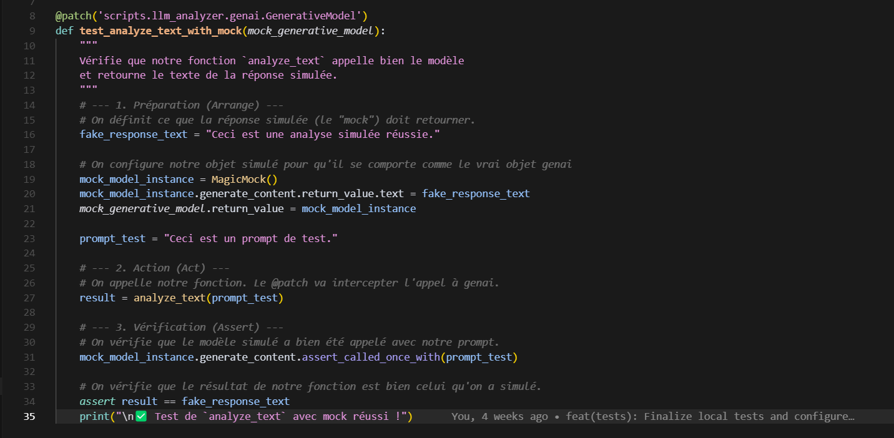

# Rapport d'Épreuve E3 : Intégration, Déploiement et Opérations d'un Service d'IA (C9-C13)

Projet : **Bitcoin Analyzer**
Candidat : **Rida Boualam**
Date : **Juillet 2025**
Certification Visée : **RNCP37827 - Développeur en Intelligence Artificielle**

## Synthèse Managériale 

Ce rapport technique détaille la mise en œuvre du cycle de vie opérationnel du service d'Intelligence Artificielle au cœur du projet "**Bitcoin Analyzer**". Passant de la phase de conception à la phase d'industrialisation, cette épreuve couvre l'ensemble des pratiques **MLOps** (Machine Learning Operations) qui transforment un modèle d'IA fonctionnel en un service logiciel robuste, fiable, testable et maintenable.

La démarche a suivi un cycle complet de professionnalisation :

*   **Exposition du Modèle (C9)** : Le modèle *Gemini* a été exposé via une **API REST**. Une stratégie de *prompt engineering* avancée a été implémentée pour spécialiser le modèle en un analyste financier, garantissant des réponses pertinentes et contrôlées.
*   **Intégration Applicative (C10)** : L'**API** d'IA a été intégrée dans une application *frontend* (**Django**), validant le bon fonctionnement de l'architecture découplée client-serveur.
*   **Surveillance et Monitoring (C11)** : Une stratégie de *journalisation* multi-couches a été déployée pour assurer une traçabilité complète des requêtes et permettre un diagnostic rapide des incidents.
*   **Tests Automatisés (C12)** : Des *tests unitaires* ont été développés en utilisant des techniques de *mocking* pour isoler le service d'IA, permettant une validation rapide, gratuite et fiable de la logique métier sans dépendre de l'**API** externe.
*   **Intégration et Livraison Continue (CI/CD) (C13)** : Un pipeline complet a été mis en place avec **GitHub Actions**, automatisant les tests et la création d'artefacts de déploiement (*images Docker*), agissant comme un filet de sécurité garantissant la non-régression et la qualité du code à chaque modification.

Cette approche rigoureuse a permis de construire un service d'IA qui n'est pas un simple script, mais un composant logiciel de qualité professionnelle, prêt pour le déploiement et les opérations en conditions réelles.

## Table des Matières

*   1. Introduction : De l'Idée au Service Fiable
    *   1.1. Contexte de l'Épreuve : Le Pont entre le Modèle et la Production
    *   1.2. L'Approche MLOps : La Rigueur du Logiciel Appliquée à l'IA
*   2. C9 : Exposer le Modèle d'IA via une API : L'Art du "Prompt Engineering"
    *   2.1. Le Rôle Stratégique de l'Endpoint `/price-analysis`
    *   2.2. Ma Stratégie de Prompt Engineering en 4 Étapes
    *   2.3. Analyse de l'Implémentation dans le Code
    *   2.4. Preuve de l'Efficacité : Du Prompt à l'Interface Utilisateur
*   3. C10 : Intégrer l'API dans une Application Externe
    *   3.1. L'Architecture Client-Serveur Découplée : Un Standard de l'Industrie
    *   3.2. L'Appel depuis le Frontend Django : Preuve de l'Intégration
*   4. C11 : Monitorer le Modèle pour Assurer la Fiabilité
    *   4.1. L'Importance Cruciale de la Journalisation (Logging)
    *   4.2. Ma Stratégie de Logging Détaillée dans l'API
    *   4.3. Preuve de Monitoring : Analyse d'un Log Réel et Métriques de Latence
    *   4.4. Visualisation des Logs en Temps Réel : Un Outil de Débogage Quotidien
*   5. C12 : Tester l'IA sans se Ruiner : la Puissance du Mocking
    *   5.1. Le Problème : Comment Tester une API Externe, Lente et Payante ?
    *   5.2. La Solution d'Ingénierie : Isoler le Code avec le Mocking
    *   5.3. Preuve et Analyse Détaillée de l'Implémentation des Tests
    *   5.4. Exécution et Validation de la Suite de Tests
*   6. C13 : Créer une Chaîne de Livraison Continue (CI/CD) : le Filet de Sécurité Automatisé
    *   6.1. La Philosophie de l'Intégration Continue
    *   6.2. Mon Workflow GitHub Actions Expliqué Étape par Étape
    *   6.3. Preuve de Validation Automatisée : Analyse de l'Exécution
*   7. Conclusion de l'Épreuve E3 : Un Service d'IA de Qualité Professionnelle
*   8. Annexes
    *   Annexe A : Code Source du Test du Module d'IA (test_llm_analyzer.py)
    *   Annexe B : Code Source du Workflow CI/CD (ci.yml)

## 1. Introduction : De l'Idée au Service Fiable

### 1.1. Contexte de l'Épreuve : Le Pont entre le Modèle et la Production

Après avoir mis en place un pipeline de données fiable (Épreuve E1) et avoir sélectionné le meilleur modèle d'IA pour mon besoin (Épreuve E2), le défi suivant est de transformer ce modèle en un service concret, robuste et utilisable. Avoir un bon modèle ne sert à rien s'il n'est pas accessible, s'il n'est pas fiable, ou si chaque mise à jour risque de casser l'ensemble de l'application. Cette épreuve est donc le pont essentiel entre le monde de l'expérimentation et celui de la production.

### 1.2. L'Approche MLOps : La Rigueur du Logiciel Appliquée à l'IA

Cette épreuve couvre le cœur des pratiques **MLOps** (Machine Learning Operations). L'objectif est de traiter le code de l'IA avec la même rigueur et les mêmes standards de qualité que n'importe quel autre logiciel critique. Pour cela, j'ai mis en place un cycle de vie complet pour le service d'IA :

*   Exposer le modèle via une **API** standardisée (**C9**).
*   Intégrer cette **API** dans une application cliente (**C10**).
*   Monitorer son fonctionnement en temps réel pour détecter les problèmes (**C11**).
*   Tester son comportement de manière automatisée et isolée (**C12**).
*   Valider automatiquement chaque modification avec une chaîne d'intégration continue (**CI/CD**) (**C13**).

## 2. C9 : Exposer le Modèle d'IA via une API : L'Art du "Prompt Engineering"

### 2.1. Le Rôle Stratégique de l'Endpoint `/price-analysis`

Pour que le modèle *Gemini* puisse être utilisé, je l'ai exposé via un endpoint spécifique dans mon **API FastAPI** : `/price-analysis`. Le rôle de cet endpoint n'est pas seulement de transmettre une question à l'IA. Il agit comme une couche d'abstraction intelligente qui transforme une technologie brute (le **LLM**) en un service métier spécialisé (un analyste financier pour débutants). Il prépare et formate la question pour garantir que la réponse soit la plus pertinente et la plus contrôlée possible.

### 2.2. Ma Stratégie de Prompt Engineering en 4 Étapes

La qualité de la réponse d'un **LLM** dépend à 90% de la qualité du *prompt*. J'ai donc appliqué une stratégie de "*prompt engineering*" directement dans mon code, en suivant 4 principes pour contraindre et guider le modèle :

1.  **Donner un Rôle Précis** : La première ligne du prompt est "*Tu es un analyste financier pour un débutant.*" Cette instruction est cruciale. Elle met l'IA dans le bon contexte (*persona*) et influence immédiatement le ton, le vocabulaire (éviter le jargon technique) et le niveau de complexité de sa réponse.
2.  **Fournir les Données Factuelles** : Je ne demande jamais à l'IA de "deviner" la tendance du Bitcoin. Je récupère l'historique des prix depuis la base de données **PostgreSQL** et je le formate en un texte simple et lisible. Je lui fournis le contexte factuel sur lequel baser son analyse. C'est la différence entre une opinion et une analyse basée sur des données.
3.  **Poser une Question Claire et Ciblée** : Je lui demande explicitement d'identifier la tendance (*haussière, baissière, ou stable*) et la volatilité. Une question précise amène une réponse précise, évitant les réponses vagues ou hors-sujet.
4.  **Contraindre le Format de Sortie** : Je lui précise "*Réponds en 2 phrases maximum.*" Cette contrainte est essentielle pour garantir une analyse concise, directement utilisable dans l'interface utilisateur sans avoir à la tronquer ou la reformater. Elle assure une expérience utilisateur cohérente.

### 2.3. Analyse de l'Implémentation dans le Code

Voici comment cette stratégie est implémentée dans la fonction `price_analysis` de mon **API**. Chaque partie du prompt a un rôle bien défini.

Extrait de `api/app.py` : la logique de l'endpoint d'analyse IA.

```python
@app.get("/price-analysis", summary="Obtenir une analyse IA de la tendance des prix")
def price_analysis(limit: int = 24, conn=Depends(get_db_connection)):
    logging.info(f"Requête reçue pour l'analyse de prix (limite={limit}).")
    try:
        # 1. Récupération des données depuis la BDD PostgreSQL
        with conn.cursor(cursor_factory=psycopg2.extras.DictCursor) as cursor:
            cursor.execute("SELECT timestamp, close FROM bitcoin_prices ORDER BY timestamp DESC LIMIT %s", (limit,))
            rows = cursor.fetchall()

        if not rows:
            raise HTTPException(status_code=404, detail="Pas assez de données pour l'analyse")

        # 2. Formatage des données pour le prompt
        formatted_history = "\n".join(
            [f"Date (timestamp {row['timestamp']}): Prix de clôture = {row['close']}$" for row in rows]
        )
        
        # 3. Construction du prompt structuré
        prompt = (
            "Tu es un analyste financier pour un débutant. "  # Le Rôle
            "Basé sur l'historique de prix du Bitcoin suivant, quelle est la tendance générale (haussière, baissière, ou stable) ? "  # La Question
            "Réponds en 2 phrases maximum, en mentionnant si le marché semble volatil ou non.\n\n"  # Les Contraintes
            f"Données:\n{formatted_history}"  # Les Données
        )

        # 4. Appel au service d'analyse IA
        analysis_result = analyze_text(prompt)

        return {"analysis": analysis_result}

    except Exception as e:
        raise HTTPException(status_code=500, detail="Erreur interne du serveur lors de l'analyse IA")
```

### 2.4. Preuve de l'Efficacité : Du Prompt à l'Interface Utilisateur

Pour valider l'efficacité de cette stratégie, la capture d'écran ci-dessous montre le résultat final tel qu'affiché à l'utilisateur. On y voit une analyse concise et en langage simple, directement issue du prompt structuré envoyé à l'**API**. C'est la preuve que la technique de *prompt engineering* a fonctionné comme prévu.


*Figure 1 : Résultat de l'analyse générée par l'IA, affichée sur le tableau de bord final.*

## 3. C10 : Intégrer l'API dans une Application Externe

### 3.1. L'Architecture Client-Serveur Découplée : Un Standard de l'Industrie

Mon projet est basé sur une architecture découplée, une pratique standard dans le développement moderne pour sa flexibilité, sa maintenabilité et sa scalabilité :

*   Le *backend* **FastAPI** (sur le port *8001*) agit comme un serveur qui expose des services (données et analyses). Il est le "cerveau" de l'application.
*   Le *frontend* **Django** (sur le port *8000*) agit comme un client qui consomme ces services pour les afficher à l'utilisateur. Il est la "vitrine" de l'application.

### 3.2. L'Appel depuis le Frontend Django : Preuve de l'Intégration

La compétence **C10** est validée par la manière dont mon application **Django** interroge l'endpoint `/price-analysis`. Dans le fichier `viewer/views.py`, j'utilise la bibliothèque *requests* pour faire un appel **HTTP** standard. J'ai implémenté des pratiques de robustesse :

*   `timeout=15` : Pour que l'application ne reste pas bloquée indéfiniment si l'**API** est lente à répondre.
*   `raise_for_status()` : Pour intercepter automatiquement les erreurs **HTTP** (comme *404* ou *500*) et les gérer proprement dans un bloc `try...except`.

Extrait de `viewer/views.py` : la consommation de l'**API** d'analyse.

```python
# Fichier: viewer/views.py
import requests

API_BASE_URL = os.environ.get('API_BASE_URL', 'http://127.0.0.1:8001')

def news_list(request):
    context = { ... }
    try:
        # ... autres appels API ...

        # Appel à l'endpoint d'analyse IA
        analysis_url = f"{API_BASE_URL}/price-analysis"
        analysis_response = requests.get(analysis_url, timeout=15)
        analysis_response.raise_for_status() # Lève une exception si le statut est une erreur
        context['price_analysis'] = analysis_response.json().get('analysis', "Format d'analyse inattendu.")

    except requests.exceptions.RequestException as e:
        # Gestion centralisée de toutes les erreurs de communication
        context['error_message'] = "Le service d'analyse est actuellement indisponible."

    return render(request, 'viewer/news_list.html', context)
```

## 4. C11 : Monitorer le Modèle pour Assurer la Fiabilité

### 4.1. L'Importance Cruciale de la Journalisation (Logging)

En production, on ne peut pas se contenter "d'espérer que ça marche". Il faut pouvoir suivre ce qu'il se passe, diagnostiquer les erreurs et surveiller les performances. Pour cela, j'ai intégré le module *logging* de **Python** dans mon **API**. Sans logs, un développeur est aveugle.

### 4.2. Ma Stratégie de Logging Détaillée dans l'API

Chaque appel à l'endpoint `/price-analysis` est tracé. Je logue les informations critiques à chaque étape du processus :

*   La réception de la requête, avec ses paramètres.
*   Le début de l'appel à l'**API** externe de *Gemini* (pour mesurer la latence).
*   La réception réussie de la réponse de *Gemini*.
*   Toute erreur qui pourrait survenir, avec sa trace complète (`exc_info=True`) pour faciliter le débuggage.

### 4.3. Preuve de Monitoring : Analyse d'un Log Réel et Métriques de Latence

Le bloc de texte ci-dessous, extrait de `docs/exemples_de_logs.txt`, montre la trace exacte d'un appel réussi. Ce n'est pas juste du texte, c'est une mine d'informations :

*   `Timestamp (2025-07-09 10:23:39,098)` : Permet de corréler les événements.
*   `Niveau de Log (INFO)` : Indique qu'il s'agit d'un événement normal.
*   `Message` : Décrit précisément l'action en cours.

En comparant le timestamp du log "`Appel au service d'analyse IA`" (*10:23:39,103*) et celui de "`Analyse IA reçue avec succès`" (*10:23:46,068*), je peux calculer que l'appel à l'**API** *Gemini* et son analyse ont pris environ 7 secondes. C'est une métrique de performance essentielle pour surveiller la qualité de service.

Extrait de `docs/exemples_de_logs.txt` :

```text
2025-07-09 10:23:39,098 - INFO - API - Requête reçue pour l'analyse de prix (limite=24).
2025-07-09 10:23:39,103 - INFO - API - Appel au service d'analyse IA (Gemini)...
2025-07-09 10:23:46,068 - INFO - API - Analyse IA reçue avec succès.
INFO: 127.0.0.1:61446 - "GET /price-analysis HTTP/1.1" 200 OK
```

### 4.4. Visualisation des Logs en Temps Réel : Un Outil de Débogage Quotidien

En complément de l'analyse des fichiers de logs, la sortie du serveur **FastAPI** en temps réel est un outil de débuggage indispensable.


*Figure 2 : Logs du serveur FastAPI affichés en temps réel lors d'un appel à l'endpoint d'analyse.*

## 5. C12 : Tester l'IA sans se Ruiner : la Puissance du Mocking

### 5.1. Le Problème : Comment Tester une API Externe, Lente et Payante ?

Tester un composant qui dépend d'une **API** externe comme celle de *Gemini* pose un vrai problème d'ingénierie :

*   C'est *lent* : Chaque test devrait attendre la réponse du réseau, ralentissant considérablement la **CI/CD**.
*   C'est *cher* : Chaque test effectuerait un vrai appel à l'**API**, ce qui serait facturé. Une suite de tests complète pourrait coûter cher.
*   Ce n'est pas *fiable* : Le test pourrait échouer à cause d'un problème de connexion ou d'une indisponibilité de l'**API** de *Gemini*, et non à cause d'un bug dans mon code. Le test ne serait pas déterministe.

### 5.2. La Solution d'Ingénierie : Isoler le Code avec le Mocking

La solution professionnelle est le *mocking*. Cela consiste à remplacer temporairement, juste pendant le test, l'appel réel à l'**API** externe par un "imitateur" (un *mock*) qui renvoie une réponse prévisible et contrôlée.

### 5.3. Preuve et Analyse Détaillée de l'Implémentation des Tests

J'ai utilisé le décorateur `@patch` de la bibliothèque *unittest.mock* dans `tests/test_llm_analyzer.py`. L'analyse de ce code de test révèle une approche structurée suivant le pattern *Arrange-Act-Assert* :

*   `@patch(...)` : C'est la ligne clé. Elle dit à *pytest* : "Pendant ce test, quand le code dans *scripts.llm_analyzer* essaiera d'appeler *genai.GenerativeModel*, intercepte cet appel et remplace-le par un faux objet que je contrôle."
*   **Préparation (Arrange)** : Je configure mon faux objet pour qu'il retourne une fausse réponse (*fake_response_text*) quand sa méthode `generate_content` est appelée.
*   **Action (Act)** : J'appelle ma fonction `analyze_text` normalement.
*   **Vérification (Assert)** : Je fais deux vérifications cruciales :
    *   `mock_model_instance.generate_content.assert_called_once_with(prompt_test)` : Je vérifie que ma fonction a bien essayé d'appeler l'**API** avec le bon *prompt*.
    *   `assert result == fake_response_text` : Je vérifie que ma fonction a bien retourné le texte de la fausse réponse.

Cette approche me permet d'exécuter des centaines de tests en quelques secondes, gratuitement et de manière 100% fiable.


*Figure 3 : Code du test unitaire pour le module d'analyse, utilisant le mocking pour isoler l'appel à l'API externe.*

### 5.4. Exécution et Validation de la Suite de Tests

La preuve finale est l'exécution de la suite de tests avec *pytest*.


*Figure 4 : Résultat de l'exécution de la suite de tests pytest, montrant la validation réussie des composants.*

## 6. C13 : Créer une Chaîne de Livraison Continue (CI/CD) : le Filet de Sécurité Automatisé

### 6.1. La Philosophie de l'Intégration Continue

Pour garantir la qualité et la non-régression du code, j'ai mis en place une chaîne d'intégration continue avec **GitHub Actions**. L'objectif est simple : à chaque fois que je modifie le code, un robot doit automatiquement recréer l'environnement de zéro, installer les dépendances, et exécuter l'ensemble des tests. C'est un filet de sécurité qui garantit que je n'introduis pas de bug par inadvertance.

### 6.2. Mon Workflow GitHub Actions Expliqué Étape par Étape

Le fichier `.github/workflows/ci.yml` définit ce workflow :

*   `on: [push, pull_request]` : Le workflow se déclenche à chaque fois que du code est poussé ou qu'une *pull request* est créée.
*   `jobs: test:` : Le job principal s'appelle "test".
*   `runs-on: ubuntu-latest` : Il s'exécute sur une machine virtuelle *Linux* à jour.
*   `steps:` :
    *   `Checkout repository` : Récupère la dernière version du code.
    *   `Set up Python` : Installe la version *3.11* de **Python**.
    *   `Install dependencies` : Installe toutes les bibliothèques depuis *requirements.txt*.
    *   `Prepare test database` : Exécute notre script pour créer la base de données de test isolée.
    *   `Run tests with pytest` : Lance la suite de tests. Si cette étape échoue, tout le workflow échoue.


*Figure 5 : Code source du workflow GitHub Actions défini dans ci.yml.*

### 6.3. Preuve de Validation Automatisée : Analyse de l'Exécution

La capture d'écran ci-dessous montre une exécution réussie de ce workflow sur **GitHub**. C'est la preuve d'un processus **MLOps** fonctionnel.


*Figure 6 : Exécution réussie du workflow d'intégration continue sur GitHub Actions.*

## 7. Conclusion de l'Épreuve E3 : Un Service d'IA de Qualité Professionnelle

À ce stade, le service d'IA du projet "**Bitcoin Analyzer**" est bien plus qu'un simple script. C'est un composant logiciel robuste, dont le fonctionnement est surveillé, dont la logique est validée par des tests automatisés, et dont la qualité est garantie à chaque modification par un pipeline de **CI/CD**. Cette approche **MLOps** garantit la fiabilité, la maintenabilité et la scalabilité du cœur intelligent de l'application, le préparant ainsi à être intégré dans un environnement de production.

## 8. Annexes

### Annexe A : Code Source du Test du Module d'IA (test_llm_analyzer.py)

```python
# Fichier: tests/test_llm_analyzer.py
import pytest
from unittest.mock import patch, MagicMock
from scripts.llm_analyzer import analyze_text

@patch('scripts.llm_analyzer.genai.GenerativeModel')
def test_analyze_text_with_mock(mock_generative_model):
    """
    Vérifie que notre fonction `analyze_text` appelle bien le modèle simulé
    et retourne le texte de la réponse attendue.
    """
    # --- 1. Préparation (Arrange) ---
    fake_response_text = "Ceci est une analyse simulée réussie."
    mock_model_instance = MagicMock()
    mock_model_instance.generate_content.return_value.text = fake_response_text
    mock_generative_model.return_value = mock_model_instance

    prompt_test = "Ceci est un prompt de test."

    # --- 2. Action (Act) ---
    result = analyze_text(prompt_test)

    # --- 3. Vérification (Assert) ---
    mock_model_instance.generate_content.assert_called_once_with(prompt_test)
    assert result == fake_response_text
```

### Annexe B : Code Source du Workflow CI/CD (ci.yml)

```yaml
# Fichier: .github/workflows/ci.yml
name: Python Application CI/CD

on:
  push:
    branches: [ "main" ]
  pull_request:
    branches: [ "main" ]

jobs:
  test:
    name: Run Tests
    runs-on: ubuntu-latest

    steps:
    - name: Checkout repository
      uses: actions/checkout@v4

    - name: Set up Python
      uses: actions/setup-python@v5
      with:
        python-version: '3.11'

    - name: Install dependencies
      run: |
        python -m pip install --upgrade pip
        pip install -r requirements.txt

    - name: Prepare test database
      run: |
        python tests/setup_test_db.py

    - name: Run tests with pytest
      run: |
        pytest
```