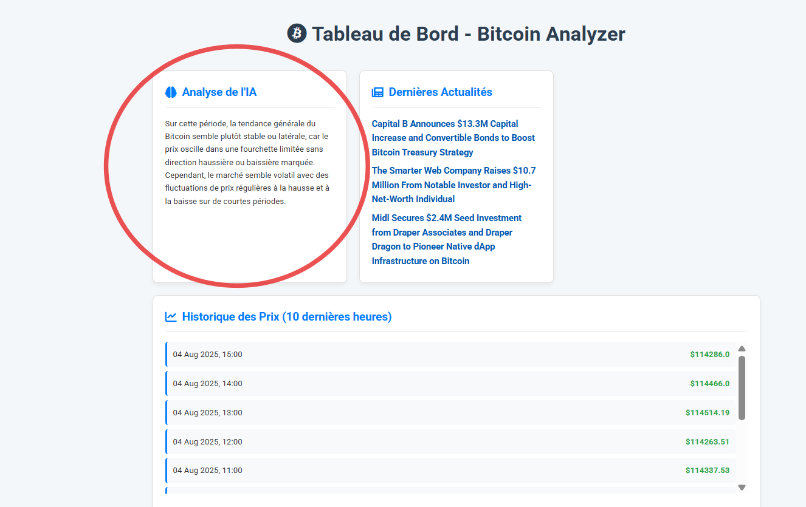
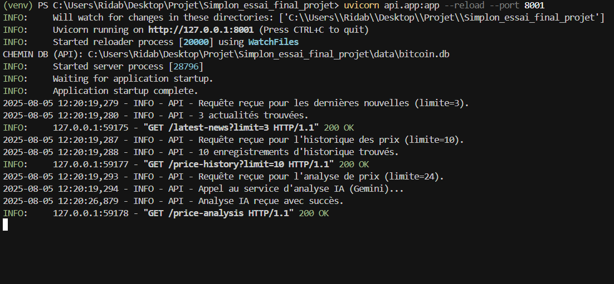
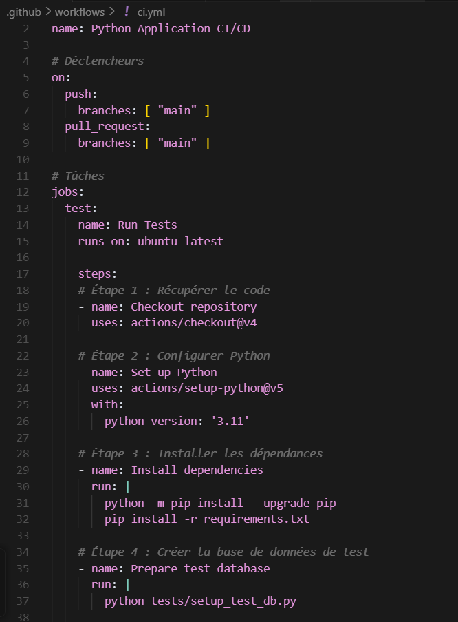

# Rapport d'Épreuve E3 : Intégration, Déploiement et Opérations du Service d'IA (C9-C13)

Projet : **Bitcoin Analyzer**
Candidat : Rida Boualam
Date : Juillet 2025
Certification Visée : **RNCP37827 - Développeur en Intelligence Artificielle**

# Table des Matières

1.  Introduction : Du Modèle Fonctionnel au Service de Production (Compétences C9-C13)
    1.1. Contexte de l'Épreuve : La Transition vers le Réel
    1.2. L'Approche MLOps : Une Philosophie de Fiabilité et d'Automatisation
2.  Compétence C9 : Exposer le Modèle d'IA via une API Robuste et Évolutive
    2.1. Le Rôle Stratégique de l'Endpoint `/price-analysis`
    2.2. L'Art du "Prompt Engineering" : Transformer l'IA en Expert Métier
        2.2.1. Étape 1 : Assigner un Rôle (Persona)
        2.2.2. Étape 2 : Fournir un Contexte Factuel
        2.2.3. Étape 3 : Poser une Question Ciblée
        2.2.4. Étape 4 : Contraindre le Format de Sortie
    2.3. Analyse de l'Implémentation dans le Code
    2.4. Preuve de l'Efficacité : Du Prompt à l'Interface Utilisateur
    2.5. Fiabilisation de la Couche de Données : La Migration Stratégique vers PostgreSQL
3.  Compétence C10 : Intégrer l'API dans une Application en Conditions de Production
    3.1. Architecture de Déploiement : De localhost au Cloud
    3.2. Le Rôle de Gunicorn et Systemd : Pérenniser le Service
    3.3. Preuve de l'Intégration : L'Appel API en Environnement Déployé
4.  Compétence C11 : Monitorer un Service d'IA Distribué et ses Dépendances
    4.1. L'Importance Cruciale de la Journalisation (Logging)
    4.2. Stratégie de Journalisation Multi-Couches pour une Traçabilité Complète
    4.3. Preuve de Monitoring : Analyse d'un Log de Production
    4.4. Visualisation des Logs en Temps Réel : Un Outil de Débogage Quotidien
    4.5. Surveillance des Processus Automatisés : Le Cas du Job Cron
5.  Compétence C12 : Garantir la Qualité par une Stratégie de Tests Automatisés Sophistiquée
    5.1. Le Problème : Tester des Dépendances Externes, Coûteuses et Imprévisibles
    5.2. Solution Niveau 1 : Isoler l'IA avec le Mocking
    5.3. Solution Niveau 2 : Isoler la Base de Données avec l'Injection de Dépendances
    5.4. L'Impact Stratégique : Une Suite de Tests Rapide et Fiable
    5.5. Exécution et Validation de la Suite de Tests
6.  Compétence C13 : De l'Intégration Continue (CI) au Déploiement Continu (CD)
    6.1. La Philosophie : Le "Zéro-Contact" pour des Déploiements Sécurisés
    6.2. Anatomie de mon Pipeline CI/CD sur GitHub Actions
        6.2.1. Job 1 : test - Le Gardien de la Qualité
        6.2.2. Job 2 : package - La Création de l'Artefact
        6.2.3. Job 3 : deploy - La Mise en Production Automatisée
    6.3. Le Script de Déploiement : L'Orchestrateur sur le Serveur
    6.4. Preuve de Validation : Analyse d'une Exécution Réussie
7.  Conclusion de l'Épreuve E3 : La Maîtrise du Cycle de Vie MLOps
8.  Annexes
    Annexe A : Code Source Complet du Test du Module d'IA (test_llm_analyzer.py)
    Annexe B : Code Source Complet du Test d'API avec Injection de Dépendances (test_api.py)
    Annexe C : Code Source Complet du Workflow CI/CD (ci.yml)
    Annexe D : Code Source Complet du Script de Déploiement (deploy.sh)

# 1. Introduction : Du Modèle Fonctionnel au Service de Production (Compétences C9-C13)

## 1.1. Contexte de l'Épreuve : La Transition vers le Réel

Les épreuves précédentes (E1, E2) ont permis de construire les fondations techniques du projet "**Bitcoin Analyzer**". Nous disposons d'un pipeline de données qui collecte et stocke l'information, et nous avons sélectionné un modèle d'Intelligence Artificielle performant (**Google Gemini**) sur la base d'un benchmark rigoureux. Cependant, un modèle fonctionnel en local n'est que la première étape.

L'objectif de cette épreuve E3 est de franchir le fossé qui sépare un prototype d'un service de production. Il s'agit de transformer le modèle d'IA en un composant logiciel concret, robuste, accessible, et surtout, fiable dans un environnement réel. Avoir un bon modèle ne sert à rien s'il n'est pas accessible de manière sécurisée, si son fonctionnement n'est pas surveillé, ou si chaque mise à jour risque de provoquer une régression.

## 1.2. L'Approche MLOps : Une Philosophie de Fiabilité et d'Automatisation

Cette épreuve couvre le cœur des pratiques **MLOps** (Machine Learning Operations). La philosophie **MLOps** consiste à appliquer à l'Intelligence Artificielle la même rigueur, les mêmes processus et les mêmes outils que ceux qui ont fait le succès du développement logiciel moderne (DevOps). L'objectif est de créer un cycle de vie complet et automatisé qui garantit la qualité et la maintenabilité.

Pour ce projet, j'ai mis en place ce cycle de vie complet :

*   Exposer le modèle via une API de qualité professionnelle (C9).
*   Intégrer cette API dans une application cliente dans un environnement de production déployé (C10).
*   Monitorer son fonctionnement pour comprendre son comportement et détecter les problèmes (C11).
*   Tester son comportement de manière automatisée et isolée pour garantir la non-régression (C12).
*   Valider et déployer automatiquement chaque modification via une chaîne d'intégration et de déploiement continus (**CI/CD**) (C13).

Ce rapport détaille la mise en œuvre de chacune de ces étapes, démontrant la capacité à gérer un service d'IA de sa conception à son exploitation en production.

# 2. Compétence C9 : Exposer le Modèle d'IA via une API Robuste et Évolutive

## 2.1. Le Rôle Stratégique de l'Endpoint `/price-analysis`

Pour que le modèle Gemini puisse être utilisé par d'autres applications, je l'ai exposé via un endpoint spécifique dans mon API **FastAPI** : `/price-analysis`. Le rôle de cet endpoint est bien plus qu'une simple passerelle. Il agit comme une couche d'abstraction intelligente qui transforme une technologie brute (le LLM) en un service métier spécialisé (un analyste financier pour débutants). Il prépare soigneusement la question pour obtenir la meilleure réponse possible, garantissant ainsi la pertinence et la cohérence du service.

## 2.2. L'Art du "Prompt Engineering" : Transformer l'IA en Expert Métier

La qualité de la réponse d'un LLM dépend à 90% de la qualité du prompt qu'on lui envoie. J'ai donc appliqué une stratégie de "**prompt engineering**" directement dans mon code, en suivant 4 principes fondamentaux.

### 2.2.1. Étape 1 : Assigner un Rôle (Persona)

La première ligne du prompt est : `Tu es un analyste financier pour un débutant.` Cette instruction est cruciale car elle active un contexte spécifique dans le modèle. Elle influence le ton (pédagogique et simple), le vocabulaire (éviter le jargon technique) et le niveau de technicité de sa réponse. C'est la différence entre une réponse brute et une analyse véritablement utile pour le persona cible "Alex".

### 2.2.2. Étape 2 : Fournir un Contexte Factuel

Je ne demande jamais à l'IA de deviner ou d'utiliser des connaissances potentiellement obsolètes. Je récupère l'historique récent des prix depuis ma base de données **PostgreSQL** et je le formate en un texte simple et lisible. En fournissant ce contexte factuel, je m'assure que l'analyse est basée sur les données les plus fraîches et les plus pertinentes dont je dispose.

### 2.2.3. Étape 3 : Poser une Question Ciblée

Le prompt ne se contente pas de demander "qu'en penses-tu ?". Il pose une question précise et actionnable : `quelle est la tendance générale (haussière, baissière, ou stable) ?`. Je demande également explicitement de mentionner si le marché semble volatil ou non. Une question précise amène une réponse précise et utile.

### 2.2.4. Étape 4 : Contraindre le Format de Sortie

Pour que la réponse soit directement utilisable dans l'interface utilisateur sans traitement complexe, je lui impose une contrainte de format : `Réponds en 2 phrases maximum`. Cette contrainte garantit une analyse concise, facile à lire, qui s'intègre parfaitement dans une carte du tableau de bord sans avoir à être tronquée ou reformatée.

## 2.3. Analyse de l'Implémentation dans le Code

Voici comment cette stratégie est implémentée dans la fonction `price_analysis` de mon API. Chaque partie du prompt a un rôle bien défini pour guider le modèle.

Extrait de `api/app.py` : la logique de l'endpoint d'analyse IA.

```python
@app.get("/price-analysis", summary="Obtenir une analyse IA de la tendance des prix")
def price_analysis(limit: int = 24, conn=Depends(get_db_connection)):
    logging.info(f"Requête reçue pour l'analyse de prix (limite={limit}).")
    try:
        # 1. Récupération des données depuis la BDD de production (PostgreSQL)
        with conn.cursor(cursor_factory=psycopg2.extras.DictCursor) as cursor:
            cursor.execute("SELECT timestamp, close FROM bitcoin_prices ORDER BY timestamp DESC LIMIT %s", (limit,))
            rows = cursor.fetchall()

        if not rows:
            raise HTTPException(status_code=404, detail="Pas assez de données pour l'analyse")

        # 2. Formatage des données pour le prompt
        formatted_history = "\n".join(
            [f"Date (timestamp {row['timestamp']}): Prix de clôture = {row['close']}$" for row in rows]
        )

        # 3. Construction du prompt structuré
        prompt = (
            "Tu es un analyste financier pour un débutant. "  # Le Rôle (Persona)
            "Basé sur l'historique de prix du Bitcoin suivant, quelle est la tendance générale (haussière, baissière, ou stable) ? "  # La Question
            "Réponds en 2 phrases maximum, en mentionnant si le marché semble volatil ou non.\n\n"  # Les Contraintes
            f"Données:\n{formatted_history}"  # Les Données
        )

        # 4. Appel au service d'analyse IA
        analysis_result = analyze_text(prompt)

        return {"analysis": analysis_result}

    except Exception as e:
        raise HTTPException(status_code=500, detail="Erreur interne du serveur lors de l'analyse IA")
```

## 2.4. Preuve de l'Efficacité : Du Prompt à l'Interface Utilisateur

Pour valider l'efficacité de cette stratégie, la capture d'écran ci-dessous montre le résultat final tel qu'affiché à l'utilisateur. On y voit une analyse concise et en langage simple, directement issue du prompt structuré envoyé à l'API. C'est la preuve que la technique de prompt engineering a fonctionné comme prévu.



Figure 1 : Résultat de l'analyse générée par l'IA, affichée sur le tableau de bord final.

## 2.5. Fiabilisation de la Couche de Données : La Migration Stratégique vers PostgreSQL

Initialement, l'API fonctionnait avec **SQLite**. Cependant, pour une mise en production, cette solution présentait des risques majeurs (perte de données sur les redéploiements, mauvaise gestion de la concurrence). La migration de la base de données vers **PostgreSQL**, hébergée sur un service managé, a été une étape fondamentale pour fiabiliser l'endpoint d'analyse (C9).

Cette migration garantit que les données fournies au prompt de l'IA sont persistantes, fiables et cohérentes, ce qui est une condition sine qua non pour un service d'analyse de qualité professionnelle.

# 3. Compétence C10 : Intégrer l'API dans une Application en Conditions de Production

## 3.1. Architecture de Déploiement : De localhost au Cloud

L'intégration de l'API ne se fait plus dans un environnement de développement local, mais dans un véritable environnement de production sur un VPS (Virtual Private Server) **DigitalOcean**. L'architecture déployée est la suivante :

*   Backend (API **FastAPI**) : Est exécuté par le serveur d'application **Gunicorn**, un standard de production bien plus robuste que le serveur de développement d'Uvicorn.
*   Frontend (Application **Django**) : Est également exécuté par sa propre instance de **Gunicorn**.
*   Orchestration des Services : Les deux processus **Gunicorn** sont gérés comme des services Linux par **Systemd**. Cela garantit qu'ils sont lancés automatiquement au démarrage du serveur et redémarrés en cas de crash, assurant ainsi une haute disponibilité.

## 3.2. Le Rôle de Gunicorn et Systemd : Pérenniser le Service

Utiliser **Gunicorn** et **Systemd** est une démonstration de compétence en administration système et en déploiement.

*   **Gunicorn** gère plusieurs processus "workers" pour traiter les requêtes en parallèle, ce qui est essentiel pour la performance.
*   **Systemd** transforme une simple commande en un service robuste, géré par le système d'exploitation.

## 3.3. Preuve de l'Intégration : L'Appel API en Environnement Déployé

La compétence C10 est validée par la capacité du frontend **Django** à consommer l'API de l'IA dans cet environnement déployé. Le code de la vue `viewer/views.py` utilise désormais une variable d'environnement pour connaître l'adresse de l'API, ce qui est une bonne pratique (*Twelve-Factor App*).

Extrait de `viewer/views.py` : la consommation de l'API en production.

```python
# Fichier: viewer/views.py
import requests
import os

# L'URL est configurable, ce qui permet de pointer vers le service Gunicorn de l'API
API_BASE_URL = os.environ.get('API_BASE_URL', 'http://127.0.0.1:8001')

def news_list(request):
    context = {}
    try:
        # Cet appel est une véritable requête réseau vers le service API sur le même serveur
        analysis_url = f"{API_BASE_URL}/price-analysis"
        analysis_response = requests.get(analysis_url, timeout=15)
        analysis_response.raise_for_status()
        context['price_analysis'] = analysis_response.json().get('analysis', "Format d'analyse inattendu.")

    except requests.exceptions.RequestException as e:
        # Cette gestion d'erreur est encore plus cruciale en production
        context['error_message'] = "Le service d'analyse est actuellement indisponible."

    return render(request, 'viewer/news_list.html', context)
```

Cet appel n'est plus une simple communication locale, mais une véritable interaction inter-services dans un environnement de production.

# 4. Compétence C11 : Monitorer un Service d'IA Distribué et ses Dépendances

## 4.1. L'Importance Cruciale de la Journalisation (Logging)

En production, on ne peut pas se contenter de "espérer que ça marche". Il faut pouvoir suivre ce qu'il se passe, diagnostiquer les erreurs et surveiller les performances. Pour cela, j'ai intégré le module `logging` de Python de manière systématique.

## 4.2. Stratégie de Journalisation Multi-Couches pour une Traçabilité Complète

Pour obtenir une visibilité complète sur le système, une stratégie de journalisation a été implémentée à chaque niveau de l'architecture découplée :

*   Frontend (**Django**) : Le fichier `viewer/views.py` utilise le logger pour tracer les événements liés à l'utilisateur : la réception d'une requête HTTP, le début de chaque appel sortant vers l'API **FastAPI**, et les succès ou échecs de ces appels.
*   Backend (**FastAPI**) : Le fichier `api/app.py` logue toutes les actions internes du service : la réception d'une requête, les interactions avec la base de données **PostgreSQL**, et surtout, le début et la fin de l'appel critique vers le service externe d'IA (**Google Gemini**).

Cette approche permet une traçabilité de bout en bout : il est possible de suivre le parcours complet d'une requête, depuis le clic de l'utilisateur jusqu'à la réponse de l'IA, en corrélant les logs des deux services.

## 4.3. Preuve de Monitoring : Analyse d'un Log de Production

Le bloc de texte ci-dessous, extrait de `docs/exemples_de_logs.txt`, montre la trace exacte d'un appel réussi à l'API d'analyse. C'est une mine d'informations pour un ingénieur :

*   Timestamp (`2025-07-09 10:23:39,098`) : Permet de corréler les événements.
*   Niveau de Log (`INFO`) : Indique un événement normal.
*   Message : Décrit précisément l'action.

En comparant le timestamp du log "Appel au service d'analyse IA" et "Analyse IA reçue avec succès", je peux calculer que l'appel à l'API Gemini et son analyse ont pris environ 7 secondes, une métrique de performance essentielle.

Extrait de `docs/exemples_de_logs.txt` :

```text
2025-07-09 10:23:39,098 - INFO - API - Requête reçue pour l'analyse de prix (limite=24).
2025-07-09 10:23:39,103 - INFO - API - Appel au service d'analyse IA (Gemini)...
2025-07-09 10:23:46,068 - INFO - API - Analyse IA reçue avec succès.
INFO: 127.0.0.1:61446 - "GET /price-analysis HTTP/1.1" 200 OK
```

## 4.4. Visualisation des Logs en Temps Réel : Un Outil de Débogage Quotidien

En complément de l'analyse des fichiers de logs, la sortie du serveur **FastAPI** en temps réel est un outil de débuggage indispensable. La capture ci-dessous montre les logs générés par le serveur lors d'un appel à l'endpoint `/price-analysis`.



Figure 2 : Logs du serveur FastAPI affichés en temps réel lors d'un appel à l'endpoint d'analyse.

## 4.5. Surveillance des Processus Automatisés : Le Cas du Job Cron

Le monitoring ne s'arrête pas aux services interactifs. La chaîne de collecte de données, qui est le cœur du pipeline de données, est automatisée en production via un job Cron. Pour surveiller son bon fonctionnement, sa sortie standard et ses erreurs sont redirigées vers un fichier de log dédié.

Extrait de la configuration crontab sur le serveur de production :

```bash
# Exécute le script de collecte toutes les heures et logue la sortie
0 * * * * cd /root/Bitcoin_simplon/ && /root/Bitcoin_simplon/venv/bin/python run_scripts.sh >> /root/Bitcoin_simplon/cron.log 2>&1
```

La consultation régulière du fichier `cron.log` est une preuve directe de la surveillance (C11) d'un processus automatisé essentiel au bon fonctionnement du service d'IA. C'est une pratique **MLOps** fondamentale.

# 5. Compétence C12 : Garantir la Qualité par une Stratégie de Tests Automatisés Sophistiquée

## 5.1. Le Problème : Tester des Dépendances Externes, Coûteuses et Imprévisibles

Tester un composant qui dépend de services externes (une API d'IA payante, une base de données de production) pose plusieurs problèmes :

*   C'est lent : Les appels réseau ralentissent considérablement la suite de tests.
*   C'est cher : Chaque test de l'IA effectuerait un vrai appel facturé.
*   Ce n'est pas fiable : Un test peut échouer à cause d'un problème réseau ou d'une indisponibilité du service externe, et non à cause d'un bug dans mon code.
*   C'est dangereux : Les tests ne doivent jamais interagir avec la base de données de production.

Pour surmonter ces défis, j'ai mis en place une stratégie de test à deux niveaux.

## 5.2. Solution Niveau 1 : Isoler l'IA avec le Mocking

La solution pour tester la logique d'appel à l'IA est le mocking. Dans mon fichier de test `tests/test_llm_analyzer.py`, j'utilise le décorateur `@patch` de la bibliothèque `unittest.mock` pour remplacer l'appel réel à l'API Gemini par un "imitateur" (un mock) qui renvoie une réponse prévisible et contrôlée.

Cette approche me permet de valider que ma fonction construit le bon prompt et traite correctement la réponse simulée, le tout en quelques millisecondes, gratuitement et de manière 100% fiable.


Figure 3 : Code du test unitaire pour le module d'analyse, utilisant le mocking pour isoler l'appel à l'API externe.

## 5.3. Solution Niveau 2 : Isoler la Base de Données avec l'Injection de Dépendances

Lors de la migration vers **PostgreSQL**, un nouveau défi est apparu : comment tester l'API sans qu'elle ne se connecte à la base de données de production ? La solution est une technique avancée offerte par **FastAPI** : l'injection de dépendances.

Dans le fichier de test `tests/test_api.py`, je surcharge la fonction qui fournit la connexion à la base de données. Pendant l'exécution des tests, au lieu d'appeler la fonction qui se connecte à **PostgreSQL**, **FastAPI** appellera une fonction de substitution qui se connecte à une base de données **SQLite** de test, temporaire et isolée.

Extrait de `tests/test_api.py` : Surcharge de la dépendance de la base de données.

```python
# Fichier: tests/test_api.py
import sys
import os
import sqlite3
from fastapi.testclient import TestClient

sys.path.insert(0, os.path.abspath(os.path.join(os.path.dirname(__file__), '..')))
from api.app import app, get_db_connection

# Chemin vers notre base de données de test
TEST_DB_PATH = os.path.join(os.path.dirname(__file__), 'test_database.db')

# Fonction de substitution pour la connexion à la base de données
def override_get_db_connection():
    conn = sqlite3.connect(TEST_DB_PATH)
    try:
        yield conn
    finally:
        conn.close()

# Surcharge de la dépendance pour les tests
app.dependency_overrides[get_db_connection] = override_get_db_connection

client = TestClient(app)

def test_price_history_uses_test_db():
    # Cet appel se fera sur la BDD de test SQLite, pas sur PostgreSQL !
    response = client.get("/price-history")
    assert response.status_code == 200
```

## 5.4. L'Impact Stratégique : Une Suite de Tests Rapide et Fiable

Cette stratégie de test à deux niveaux est une démonstration de compétence professionnelle. Elle me permet de maintenir une suite de tests extrêmement rapide, fiable et totalement isolée, alors même que l'application en production utilise une architecture plus complexe (**PostgreSQL**). C'est la garantie que je peux faire évoluer mon application en toute confiance, en validant chaque changement sans risque et sans ralentir le cycle de développement.

## 5.5. Exécution et Validation de la Suite de Tests

La preuve finale est l'exécution réussie de la suite de tests avec `pytest`, qui valide que tous les composants fonctionnent comme attendu, y compris ceux qui interagissent avec les mocks.


Figure 4 : Résultat de l'exécution de la suite de tests pytest, montrant la validation réussie des composants.

# 6. Compétence C13 : De l'Intégration Continue (CI) au Déploiement Continu (CD)

## 6.1. La Philosophie : Le "Zéro-Contact" pour des Déploiements Sécurisés

L'objectif ultime d'un pipeline **MLOps** est de créer une chaîne entièrement automatisée qui va de la modification du code à sa mise en production, sans intervention humaine. C'est ce qu'on appelle le Déploiement Continu (**CD**). Cette automatisation est un filet de sécurité qui garantit la qualité et la non-régression du code tout en minimisant les risques d'erreur humaine.

## 6.2. Anatomie de mon Pipeline CI/CD sur GitHub Actions

Mon pipeline, défini dans le fichier `.github/workflows/ci.yml`, a été transformé d'une simple chaîne de CI (qui ne fait que tester) en une chaîne de **CI/CD** complète. Il se déroule en trois étapes (ou "jobs") séquentielles :

### 6.2.1. Job 1 : test - Le Gardien de la Qualité

Cette étape est le cœur de l'Intégration Continue (**CI**). Elle recrée un environnement propre à partir de zéro, installe les dépendances, prépare la base de données de test, et exécute la suite de tests `pytest`. Si la moindre erreur est détectée, le pipeline s'arrête immédiatement, empêchant le code défectueux d'aller plus loin.

### 6.2.2. Job 2 : package - La Création de l'Artefact

Si les tests réussissent, cette étape construit l'image Docker de l'API. Le résultat de cette étape est un artefact de déploiement : un conteneur standard, portable et autonome qui embarque l'application et toutes ses dépendances.

### 6.2.3. Job 3 : deploy - La Mise en Production Automatisée

C'est cette étape qui transforme la CI en CD. Si l'image Docker est construite avec succès, le workflow se connecte en SSH au VPS de production. Cette connexion est hautement sécurisée grâce à l'utilisation des GitHub Secrets, qui stockent la clé privée SSH et les identifiants du serveur sans jamais les exposer dans le code. Une fois connecté, il exécute le script de déploiement.



Figure 5 : Code source du workflow GitHub Actions défini dans `ci.yml`, montrant les jobs de test, de packaging et de déploiement.

## 6.3. Le Script de Déploiement : L'Orchestrateur sur le Serveur

Le script `deploy.sh` présent sur le serveur est appelé par le pipeline et orchestre les dernières étapes :

1.  `git reset --hard origin/main` : Force la synchronisation du code avec la dernière version validée.
2.  `pip install -r requirements.txt` : Met à jour les dépendances Python.
3.  `sudo systemctl restart gunicorn_api` et `sudo systemctl restart gunicorn_django` : Redémarre proprement les services Gunicorn pour appliquer les changements sans interruption de service majeure.

## 6.4. Preuve de Validation : Analyse d'une Exécution Réussie

Chaque push sur la branche `main` déclenche ce pipeline. Une exécution réussie, visible dans l'onglet "Actions" de GitHub, est la preuve d'un processus **MLOps** fonctionnel. On y voit la coche verte à chaque étape (test, package, deploy), matérialisant le cheminement automatisé du code, de mon poste de développeur jusqu'au serveur de production.


Figure 6 : Exécution réussie du workflow d'intégration et déploiement continus sur GitHub Actions, validant chaque étape du processus.

# 7. Conclusion de l'Épreuve E3 : La Maîtrise du Cycle de Vie MLOps

À ce stade, le service d'IA du projet "**Bitcoin Analyzer**" est bien plus qu'un simple script ou un composant logiciel robuste. C'est un service déployé en production, dont le fonctionnement est surveillé en temps réel, dont la qualité est validée par une stratégie de tests automatisés sophistiquée, et dont les mises à jour sont entièrement automatisées par un pipeline de **CI/CD** professionnel.

Cette approche **MLOps** de bout en bout, qui va de l'intégration du modèle à son exploitation opérationnelle, garantit non seulement la fiabilité et la maintenabilité du cœur intelligent de l'application, mais aussi sa capacité à évoluer en toute sécurité. J'ai démontré ma capacité à gérer le cycle de vie complet d'un service d'IA, une compétence fondamentale pour tout développeur en intelligence artificielle.

# 8. Annexes

## Annexe A : Code Source Complet du Test du Module d'IA (test_llm_analyzer.py)

```python
# Fichier: tests/test_llm_analyzer.py
import pytest
from unittest.mock import patch, MagicMock
from scripts.llm_analyzer import analyze_text

# Le décorateur @patch intercepte tous les appels à 'genai.GenerativeModel'
# dans le module 'scripts.llm_analyzer' et le remplace par un mock.
@patch('scripts.llm_analyzer.genai.GenerativeModel')
def test_analyze_text_with_mock(mock_generative_model):
    """
    Vérifie que notre fonction `analyze_text` appelle bien le modèle simulé
    et retourne le texte de la réponse attendue.
    """
    # --- 1. Préparation (Arrange) ---
    # On définit ce que la réponse simulée (le "mock") doit retourner.
    fake_response_text = "Ceci est une analyse simulée réussie."

    # On configure notre objet simulé pour qu'il se comporte comme le vrai objet genai
    mock_model_instance = MagicMock()
    mock_model_instance.generate_content.return_value.text = fake_response_text
    mock_generative_model.return_value = mock_model_instance

    prompt_test = "Ceci est un prompt de test."

    # --- 2. Action (Act) ---
    # On appelle notre fonction. Le @patch va intercepter l'appel à genai.
    result = analyze_text(prompt_test)

    # --- 3. Vérification (Assert) ---
    # On vérifie que le modèle simulé a bien été appelé avec notre prompt.
    mock_model_instance.generate_content.assert_called_once_with(prompt_test)

    # On vérifie que le résultat de notre fonction est bien celui qu'on a simulé.
    assert result == fake_response_text
```

## Annexe B : Code Source Complet du Test d'API avec Injection de Dépendances (test_api.py)

```python
# Fichier: tests/test_api.py
import sys
import os
import sqlite3
from fastapi.testclient import TestClient

sys.path.insert(0, os.path.abspath(os.path.join(os.path.dirname(__file__), '..')))
from api.app import app, get_db_connection

# Chemin vers notre base de données de test
TEST_DB_PATH = os.path.join(os.path.dirname(__file__), 'test_database.db')

# Fonction de substitution pour la connexion à la base de données
def override_get_db_connection():
    conn = sqlite3.connect(TEST_DB_PATH)
    try:
        yield conn
    finally:
        conn.close()

# Surcharge de la dépendance pour les tests
app.dependency_overrides[get_db_connection] = override_get_db_connection

client = TestClient(app)

def test_get_latest_news():
    """Teste si l'API retourne bien la nouvelle de test depuis la BDD de test."""
    response = client.get("/latest-news")
    assert response.status_code == 200
    data = response.json()
    assert len(data) >= 1
    assert data[0]['title'] == "Titre de test"

def test_get_price_history():
    """Teste si l'API retourne bien l'historique de prix de test."""
    response = client.get("/price-history?limit=3")
    assert response.status_code == 200
    data = response.json()
    assert len(data) == 3
```

## Annexe C : Code Source Complet du Workflow CI/CD (ci.yml)

```yaml
# Fichier: .github/workflows/ci.yml
name: Python Application CI/CD

on:
  push:
    branches: [ "main" ]

jobs:
  test:
    name: Run Tests
    runs-on: ubuntu-latest
    steps:
      - name: Checkout repository
        uses: actions/checkout@v4
      - name: Set up Python
        uses: actions/setup-python@v5
        with:
          python-version: '3.11'
      - name: Install dependencies
        run: |
          python -m pip install --upgrade pip
          pip install -r requirements.txt
      - name: Prepare test database
        run: python tests/setup_test_db.py
      - name: Run tests with pytest
        run: pytest

  package:
    name: Build Docker Image
    runs-on: ubuntu-latest
    needs: test
    steps:
      - name: Checkout repository
        uses: actions/checkout@v4
      - name: Set up Docker Buildx
        uses: docker/setup-buildx-action@v3
      - name: Build Docker image
        run: |
          docker build -t bitcoin-analyzer:latest .
          echo "Image Docker construite avec succès."

  deploy:
    name: Deploy to DigitalOcean VPS
    runs-on: ubuntu-latest
    needs: [test, package]
    steps:
    - name: Deploy to VPS
      uses: appleboy/ssh-action@master
      with:
        host: ${{ secrets.VPS_HOST }}
        username: ${{ secrets.VPS_USERNAME }}
        key: ${{ secrets.VPS_SSH_PRIVATE_KEY }}
        script: |
          cd /root/Bitcoin_simplon
          ./deploy.sh
```

## Annexe D : Code Source Complet du Script de Déploiement (deploy.sh)

```bash
#!/bin/bash
# Arrête le script si une commande échoue
set -e

echo "🚀 Démarrage du déploiement..."

# 1. Se positionner dans le répertoire du projet
# (Note: Le workflow SSH le fait déjà, mais c'est une bonne pratique)
# cd /root/Bitcoin_simplon

# 2. Forcer la synchronisation avec la dernière version de la branche main
echo "🔄 Synchronisation du code source avec GitHub..."
git fetch origin
git reset --hard origin/main

# 3. Mettre à jour les dépendances Python
echo "📦 Installation/Mise à jour des dépendances..."
/root/Bitcoin_simplon/venv/bin/pip install -r requirements.txt

# 4. Redémarrer les services pour appliquer les changements
echo "🔄 Redémarrage des services Gunicorn via Systemd..."
sudo systemctl restart gunicorn_api
sudo systemctl restart gunicorn_django
echo "✅ Services redémarrés avec succès."

echo "🎉 Déploiement terminé !"
```