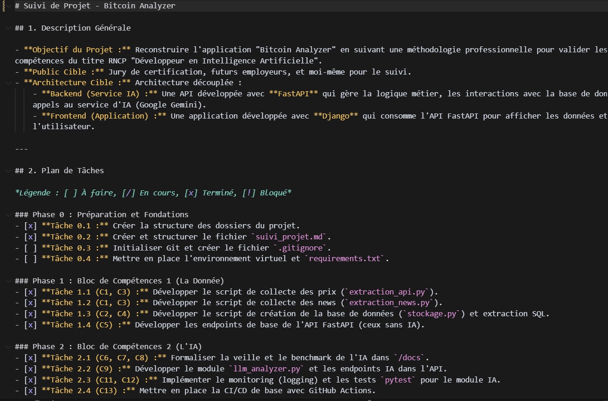
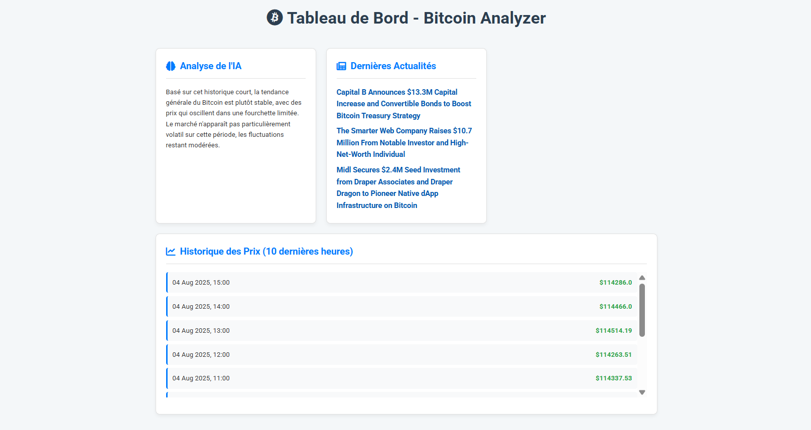

# Rapport d'Épreuve E4: Développement et Livraison de l'Application d'IA (C14-C19)

**Projet:** Bitcoin Analyzer
**Candidat:** Rida Boualam
**Date:** Juillet 2025
**Certification Visée:** RNCP37827 - Développeur en Intelligence Artificielle

## Table des Matières

*   [Introduction : De l'API au Produit Fini](#1-introduction--de-lapi-au-produit-fini)
    *   [1.1. Contexte de l'Épreuve E4](#11-contexte-de-lépreuve-e4)
    *   [1.2. Philosophie de Développement : Une Approche Centrée sur l'Utilisateur et la Qualité](#12-philosophie-de-développement--une-approche-centrée-sur-lutilisateur-et-la-qualité)
*   [C14 : Analyse des Besoins et Spécifications Fonctionnelles](#2-c14--analyse-des-besoins-et-spécifications-fonctionnelles)
    *   [2.1. Vision du Produit : Rendre la Donnée Accessible](#21-vision-du-produit--rendre-la-donnée-accessible)
    *   [2.2. Persona Utilisateur Cible : Alex, l'Investisseur Prudent](#22-persona-utilisateur-cible--alex-linvestisseur-prudent)
    *   [2.3. Récits Utilisateurs (User Stories)](#23-récits-utilisateurs-user-stories)
    *   [2.4. Fonctionnalités Hors Périmètre (Version 1.0)](#24-fonctionnalités-hors-périmètre-version-10)
*   [C15 : Conception de l'Architecture Applicative](#3-c15--conception-de-larchitecture-applicative)
    *   [3.1. Schéma de l'Architecture Découplée](#31-schéma-de-larchitecture-découplée)
    *   [3.2. Justification de la Pile Technologique](#32-justification-de-la-pile-technologique)
*   [C16 : Coordination et Méthodologie de Projet](#4-c16--coordination-et-méthodologie-de-projet)
    *   [4.1. L'Agilité Appliquée à un Projet Solo](#41-lagilité-appliquée-à-un-projet-solo)
    *   [4.2. Le Fichier suivi_projet.md comme Outil de Pilotage](#42-le-fichier-suivi_projetmd-comme-outil-de-pilotage)
*   [C17 : Développement de l'Application Frontend (Django)](#5-c17--développement-de-lapplication-frontend-django)
    *   [5.1. Structure du Projet Django](#51-structure-du-projet-django)
    *   [5.2. Logique de Routage des URLs](#52-logique-de-routage-des-urls)
    *   [5.3. La Vue Principale : Orchestrateur Robuste des Appels API](#53-la-vue-principale--orchestrateur-robuste-des-appels-api)
    *   [5.4. Le Template : Interface Utilisateur Dynamique et Accessible](#54-le-template--interface-utilisateur-dynamique-et-accessible)
*   [C18 & C19 : Automatisation des Tests et Livraison Continue (CI/CD)](#6-c18--c19--automatisation-des-tests-et-livraison-continue-cicd)
    *   [6.1. Stratégie de Tests d'Intégration et Isolation des Environnements](#61-stratégie-de-tests-dintégration-et-isolation-des-environnements)
    *   [6.2. Le Packaging avec Docker : Créer un Artefact Déployable](#62-le-packaging-avec-docker--créer-un-artefact-déployable)
    *   [6.3. Le Workflow GitHub Actions : De l'Intégration à la Livraison Continue](#63-le-workflow-github-actions--de-lintégration-à-la-livraison-continue)
*   [Conclusion de l'Épreuve E4](#7-conclusion-de-lépreuve-e4)
*   [Annexes](#8-annexes)
    *   [Annexe A : Code Source de la Vue Principale (viewer/views.py)](#annexe-a--code-source-de-la-vue-principale-viewerviewspy)
    *   [Annexe B : Code Source des Tests d'API (tests/test_api.py)](#annexe-b--code-source-des-tests-dapi-teststest_apipy)
    *   [Annexe C : Fichier de Configuration Docker (dockerfile)](#annexe-c--fichier-de-configuration-docker-dockerfile)
    *   [Annexe D : Fichier du Workflow CI/CD (ci.yml)](#annexe-d--fichier-du-workflow-cicd-ciyml)

---

## 1. Introduction: De l'API au Produit Fini

### 1.1. Contexte de l'Épreuve E4

Les épreuves précédentes (**E1**, **E2**, **E3**) ont permis de construire les fondations techniques du projet "**Bitcoin Analyzer**". Nous disposons désormais d'un pipeline de données robuste et d'un service d'IA fonctionnel, le tout exposé via une **API backend** performante et documentée. Cependant, un service backend, aussi puissant soit-il, n'a de valeur que s'il est accessible et utile à un utilisateur final.

L'objectif de cette épreuve **E4** est de franchir cette dernière étape : transformer notre service d'IA en une application web complète, interactive et fiable. Il s'agit de construire la partie visible de l'iceberg, l'interface avec laquelle l'utilisateur interagit, tout en garantissant que l'ensemble du système est testé, packagé et prêt à être déployé de manière continue.

### 1.2. Philosophie de Développement : Une Approche Centrée sur l'Utilisateur et la Qualité

Pour cette phase, j'ai adopté une philosophie de développement qui repose sur deux piliers fondamentaux :

*   **L'Expérience Utilisateur (UX)** : L'application doit être conçue en pensant constamment à l'utilisateur final. Cela signifie non seulement une interface claire et intuitive, mais aussi une gestion robuste des erreurs et une performance optimale. L'objectif est de répondre aux besoins définis dans les spécifications fonctionnelles de manière simple et élégante.
*   **La Qualité Logicielle (DevOps/MLOps)** : Chaque ligne de code ajoutée doit être validée. Chaque composant doit être testé. L'ensemble de l'application doit être packagé dans un format standard (**Docker**) et son intégration doit être vérifiée automatiquement par une chaîne de **CI/CD**. Cette rigueur garantit la maintenabilité, la fiabilité et la non-régression du produit.

Ce rapport détaille la mise en œuvre de ces principes à travers la validation des compétences **C14** à **C19** du référentiel.

## 2. C14: Analyse des Besoins et Spécifications Fonctionnelles

Toute application réussie commence par une compréhension claire du problème à résoudre et des besoins de l'utilisateur. Cette phase d'analyse est cruciale pour définir un périmètre clair et guider le développement.

### 2.1. Vision du Produit : Rendre la Donnée Accessible

Le marché du **Bitcoin** est saturé d'informations complexes, techniques et souvent contradictoires. "**Bitcoin Analyzer**" a pour vision de devenir le tableau de bord de référence pour l'investisseur amateur en rendant l'information financière sur le **Bitcoin** accessible, digeste et actionnable.

### 2.2. Persona Utilisateur Cible : Alex, l'Investisseur Prudent

Pour incarner cette vision, j'ai défini un persona utilisateur qui a servi de fil conducteur à toutes les décisions de conception.

**Biographie** : **Alex**, 30 ans, travaille dans le marketing. Il s'intéresse aux nouvelles technologies et a investi une petite somme dans le **Bitcoin**, mais n'a ni le temps ni l'expertise pour une analyse approfondie.

**Besoins** :

*   Comprendre rapidement la "température" du marché.
*   Accéder aux actualités importantes qui peuvent influencer le cours.
*   Visualiser la tendance récente sans avoir à interpréter des graphiques de trading complexes.

**Frustrations** :

*   "Je suis noyé sous le jargon technique."
*   "Je ne sais pas distinguer une information importante du bruit ambiant."
*   "Les outils de trading professionnels sont trop intimidants."

### 2.3. Récits Utilisateurs (User Stories)

Les besoins d'**Alex** ont été traduits en récits utilisateurs concrets, chacun avec des critères d'acceptation précis qui ont guidé le développement.

**ID : US-01 - Consultation des Actualités Centralisées**
En tant qu'**Alex**, l'investisseur prudent, je veux consulter les titres des dernières actualités sur une seule et même page, afin de me tenir informé rapidement sans avoir à visiter plusieurs sites.

**Critères d'Acceptation** :

*   Le tableau de bord affiche les dernières actualités.
*   Chaque titre est un lien cliquable redirigeant vers l'article source.
*   Un message clair s'affiche si aucune actualité n'est disponible.

**ID : US-02 - Accès à une Analyse Simplifiée par l'IA**
En tant qu'**Alex**, je veux lire une analyse de la tendance du marché rédigée en langage simple, afin de comprendre l'orientation générale du marché sans connaissances techniques.

**Critères d'Acceptation** :

*   L'analyse est générée par le service d'IA (**Gemini**).
*   Le texte est concis (2-3 phrases maximum).
*   La section est clairement identifiée ("Analyse de l'IA").
*   Accessibilité : Le contraste des couleurs respecte les normes **WCAG**.

**ID : US-03 - Visualisation de l'Historique des Prix**
En tant qu'**Alex**, je veux voir un historique simple des prix de clôture récents, afin de visualiser la volatilité de manière factuelle.

**Critères d'Acceptation** :

*   Le tableau de bord affiche une liste des prix de clôture.
*   Chaque entrée indique une date/heure lisible et le prix.
*   La liste est triée de la plus récente à la plus ancienne.

### 2.4. Fonctionnalités Hors Périmètre (Version 1.0)

Pour garantir une livraison ciblée et de qualité, les fonctionnalités suivantes ont été volontairement écartées de cette première version :

*   Comptes utilisateurs et authentification.
*   Personnalisation du tableau de bord.
*   Graphiques interactifs avancés.

## 3. C15: Conception de l'Architecture Applicative

Une fois le besoin défini, la conception technique vise à construire un système robuste, maintenable et évolutif pour y répondre.

### 3.1. Schéma de l'Architecture Découplée

Le projet repose sur une architecture microservices découplée, un standard de l'industrie qui sépare clairement les responsabilités.


**Flux de Données** :

*   L'utilisateur (**Alex**) accède à l'application via son navigateur, envoyant une requête au serveur **Django** (Port 8000).
*   La vue **Django**, agissant comme un client, envoie des requêtes HTTP à l'**API FastAPI** (Port 8001) pour obtenir les données nécessaires (actualités, prix, analyse).
*   L'**API FastAPI** orchestre la récupération des données :
    *   Elle interroge la base de données **PostgreSQL** pour les données stockées.
    *   Elle appelle l'API externe de **Google Gemini** pour générer l'analyse.
*   **FastAPI** retourne les données agrégées au format JSON à **Django**.
*   **Django** utilise ces données pour générer la page HTML finale et la renvoie au navigateur de l'utilisateur.

### 3.2. Justification de la Pile Technologique

Chaque choix technologique a été mûrement réfléchi pour répondre aux besoins spécifiques du projet et à ses contraintes de déploiement.

**Langage : Python 3.11**
**Justification** : Choix naturel pour un projet d'IA grâce à son écosystème mature (**requests**, **feedparser**) et ses frameworks web de premier plan.

**Backend : FastAPI**
**Justification** :
*   **Performance** : L'un des frameworks **Python** les plus rapides, idéal pour une API réactive.
*   **Documentation Automatique** : La génération native de **Swagger UI (OpenAPI)** est un atout majeur pour la validation de la compétence **C5** et la maintenabilité.
*   **Validation des Données** : **Pydantic** assure la robustesse des entrées/sorties.
**Alternative Écartée (Flask)** : Nécessiterait des bibliothèques tierces pour atteindre le même niveau de fonctionnalité, complexifiant la maintenance.

**Frontend : Django**
**Justification** :
*   **Framework Complet** : Offre une structure robuste avec un ORM, un système de templates puissant et des fonctionnalités de sécurité intégrées.
*   **Démonstration de Compétence** : Utiliser **Django** comme simple consommateur d'API démontre la maîtrise des architectures découplées, une compétence clé dans le monde professionnel.
**Alternative Écartée (Streamlit)** : Excellent pour les prototypes, mais moins adapté pour une application web personnalisable et évolutive.

**Base de Données : Stratégie Hybride SQLite & PostgreSQL**
**Justification** : Une décision d'architecture clé a été de mettre en place une stratégie à double base de données pour optimiser à la fois le développement et la production.
*   **SQLite (en Développement et Test)** : Choisi pour sa simplicité et sa rapidité. Il ne nécessite aucun serveur, ce qui accélère la mise en place de l'environnement local et rend les tests automatisés dans le pipeline de **CI/CD** extrêmement rapides.
*   **PostgreSQL (en Production)** : Indispensable pour un déploiement robuste. Contrairement à **SQLite** qui est basé sur un fichier, **PostgreSQL** est un SGBD client-serveur qui garantit la persistance des données dans des environnements cloud où le système de fichiers peut être éphémère. C'est le standard de l'industrie pour les applications fiables et scalables.
**Mise en œuvre** : Le code a été conçu pour basculer de manière transparente entre les deux systèmes grâce à la variable d'environnement **DATABASE_URL**, démontrant une conception prête pour la production.

**Service d'IA : Google Gemini**
**Justification** : Ce choix est le fruit d'un benchmark formel (**C7**) qui a démontré que **Gemini** offrait le meilleur compromis performance/coût/facilité d'intégration pour ce projet.

## 4. C16: Coordination et Méthodologie de Projet

### 4.1. L'Agilité Appliquée à un Projet Solo

Bien que ce projet soit développé par une seule personne, j'ai appliqué les principes de la méthodologie **Agile** pour structurer mon travail. Dans ce contexte, l'agilité se traduit par :

*   **Développement Itératif** : Le projet a été construit brique par brique (données, puis API, puis IA, puis frontend), chaque étape étant fonctionnelle avant de passer à la suivante.
*   **Backlog de Tâches** : Une liste de tâches claire, dérivée des user stories, a été maintenue pour suivre l'avancement.
*   **Flexibilité** : La capacité à s'adapter aux imprévus, comme la nécessité de pivoter de **SQLite** à **PostgreSQL** pour la production ou de changer de source pour le scraping (documenté dans **C21**), est au cœur de l'approche agile.

### 4.2. Le Fichier suivi_projet.md comme Outil de Pilotage

Pour matérialiser cette approche, le fichier `suivi_projet.md` a servi d'outil de pilotage central, agissant comme un tableau **Kanban** et un journal de bord.

*   **Plan de Tâches** : La section "Plan de Tâches" a permis de visualiser l'état de chaque fonctionnalité (À faire, En cours, Terminé).
*   **Journal d'Avancement** : Chaque avancée majeure a été consignée, liant une action technique à une compétence du référentiel.
*   **Suivi des Erreurs** : Chaque incident technique a été documenté avec son diagnostic, sa résolution et les leçons apprises.

Ce document n'est pas seulement une exigence de certification ; c'est un outil de travail qui a structuré l'ensemble du projet et qui prouve une approche méthodique et organisée.



## 5. C17: Développement de l'Application Frontend (Django)

Cette section détaille la construction concrète de l'application web qui expose les services de l'IA à l'utilisateur final.

### 5.1. Structure du Projet Django

La structure du code respecte scrupuleusement les conventions de **Django** pour garantir la clarté et la maintenabilité.

```
.
├── dashboard/         # Projet Django principal
│   ├── settings.py    # Configuration globale
│   └── urls.py        # Routage principal
│
└── viewer/            # Application Django dédiée à l'affichage
    ├── templates/
    │   └── viewer/
    │       └── news_list.html  # Le template de notre page
    ├── urls.py        # Routage de l'application 'viewer'
    └── views.py       # Logique de la page
```

Cette organisation sépare la configuration du projet (**dashboard**) de la logique applicative (**viewer**), ce qui est une bonne pratique pour les projets de toute taille.

### 5.2. Logique de Routage des URLs

Le routage est géré de manière hiérarchique. Le fichier principal `dashboard/urls.py` délègue la gestion des URLs à l'application **viewer**.

Extrait de `dashboard/urls.py` :

```python
from django.urls import path, include
urlpatterns = [path('', include('viewer.urls'))]
```

Extrait de `viewer/urls.py` :

```python
from django.urls import path
from . import views
urlpatterns = [path('', views.news_list, name='news_list')]
```

### 5.3. La Vue Principale : Orchestrateur Robuste des Appels API

La vue `viewer/views.py` est le cœur de l'application frontend. Elle a la responsabilité d'interroger les différents endpoints de l'**API FastAPI**, de gérer les erreurs de communication, de formater les données pour l'affichage, et de les transmettre au template.

Le code est conçu pour être robuste : un bloc `try...except` global intercepte les `requests.exceptions.RequestException`, ce qui empêche l'application de planter si l'API backend est indisponible et permet d'afficher un message d'erreur clair à l'utilisateur.

Une attention particulière a été portée au formatage des données, notamment la conversion des timestamps **Unix** (ex: 1700000000) en un format lisible par l'homme (ex: 14 Nov 2023, 22:33), une étape cruciale pour répondre aux besoins d'**Alex**, notre persona.

(Le code complet de cette vue est disponible en [Annexe A](#annexe-a--code-source-de-la-vue-principale-viewerviewspy))

### 5.4. Le Template : Interface Utilisateur Dynamique et Accessible

Le fichier `viewer/templates/viewer/news_list.html` est responsable de l'affichage final. Il utilise le langage de template de **Django** pour générer le HTML de manière dynamique à partir des données fournies par la vue.

**Affichage Conditionnel** : Des balises `` et `` permettent d'adapter l'affichage en fonction de la disponibilité des données, améliorant la robustesse de l'interface.
**Design et UX** : Le **CSS** a été entièrement revu pour offrir une expérience moderne et professionnelle. L'interface est basée sur un système de "cartes" qui segmentent clairement l'information (Analyse IA, Actualités, Historique des Prix). Des icônes et une typographie soignée renforcent la lisibilité et l'attrait visuel.
**Accessibilité** : L'utilisation de balises sémantiques (`<h1>`, `<h2>`, etc.) et les contrastes de couleurs ont été pensés pour respecter les standards d'accessibilité (**WCAG**), répondant ainsi à un critère clé du référentiel.



## 6. C18 & C19: Automatisation des Tests et Livraison Continue (CI/CD)

Pour garantir la qualité et la fiabilité de l'application, une chaîne complète de tests automatisés et de livraison continue a été mise en place, du code local jusqu'au déploiement.

### 6.1. Stratégie de Tests d'Intégration et Isolation des Environnements

Pour valider le comportement de l'**API FastAPI** (**C18**), des tests d'intégration ont été développés dans `tests/test_api.py`. Un point crucial de cette stratégie est l'isolation totale de l'environnement de test. Le script `tests/setup_test_db.py` crée une base de données **SQLite** de test dédiée. Ensuite, grâce à l'injection de dépendances de **FastAPI** (`app.dependency_overrides`), les tests forcent l'API à utiliser cette base **SQLite** temporaire, même si l'application de production est configurée pour **PostgreSQL**.

Cette technique avancée garantit des tests :

*   **Rapides** : Pas de latence réseau vers une BDD externe.
*   **Fiables et Reproductibles** : Indépendants de l'état de la base de production.
*   **Gratuits** : N'utilisent aucune ressource cloud payante.

(Le code complet de ces tests est disponible en [Annexe B](#annexe-b--code-source-des-tests-dapi-teststest_apipy))


### 6.2. Le Packaging avec Docker : Créer un Artefact Déployable

Pour préparer le déploiement (**C19**), l'**API FastAPI** a été "packagée" dans une image **Docker**. **Docker** permet de créer un conteneur standard, portable et autonome qui embarque l'application et toutes ses dépendances. C'est la première étape vers un déploiement professionnel.

Le `dockerfile` a été optimisé pour la production :

*   Utilisation d'une image de base légère (**python:3.11-slim**) pour réduire la taille.
*   Utilisation du cache **Docker** en séparant l'installation des dépendances de la copie du code.
*   Définition de la commande de démarrage du serveur **uvicorn**.

(Le code complet du Dockerfile est disponible en [Annexe C](#annexe-c--fichier-de-configuration-docker-dockerfile))

### 6.3. Le Workflow GitHub Actions : De l'Intégration à la Livraison Continue

Le fichier `.github/workflows/ci.yml` définit le pipeline complet. À chaque push sur la branche `main`, le workflow exécute automatiquement les étapes suivantes :

**Job test** :

*   Récupère le code.
*   Installe l'environnement **Python**.
*   Installe les dépendances listées dans `requirements.txt`.
*   Prépare la base de données de test **SQLite**.
*   Exécute la suite de tests **pytest**. Si cette étape échoue, le workflow s'arrête.

**Job package** :

*   Ne s'exécute que si le job `test` a réussi (`needs: test`).
*   Construit l'image **Docker** de l'API.

**Job deploy** :

*   Ne s'exécute que si les jobs `test` et `package` ont réussi.
*   Se connecte au VPS via **SSH**.
*   Exécute le script `deploy.sh` sur le serveur, qui met à jour le code et redémarre les services.

Ce pipeline garantit que toute modification du code est non seulement valide (passe les tests), mais produit également un artefact de déploiement (l'image **Docker**) et est automatiquement mise en production. C'est la définition même de la **Livraison Continue**.

(Le code complet du workflow est disponible en [Annexe D](#annexe-d--fichier-du-workflow-cicd-ciyml))


## 7. Conclusion de l'Épreuve E4

Cette épreuve a permis de transformer un ensemble de services backend en une application web complète, robuste et prête pour la production. En partant de l'analyse des besoins de l'utilisateur, en passant par la conception d'une architecture découplée et le développement d'une interface soignée, jusqu'à la mise en place d'une chaîne de tests et de livraison continue avec **Docker** et **GitHub Actions**, toutes les compétences du bloc **C14** à **C19** ont été mobilisées et validées.

Le projet "**Bitcoin Analyzer**" n'est plus seulement une collection de scripts, mais un produit logiciel cohérent, dont la qualité est garantie par des processus automatisés. L'application répond aux spécifications fonctionnelles initiales et son architecture est conçue pour être maintenable et évolutive.

## 8. Annexes

### Annexe A : Code Source de la Vue Principale (viewer/views.py)

```python
# Fichier: viewer/views.py
from django.shortcuts import render
import requests
import logging
from datetime import datetime

logger = logging.getLogger(__name__)

API_BASE_URL = "http://127.0.0.1:8001"

def news_list(request):
    logger.info(f"Requête reçue pour le tableau de bord depuis l'IP : {request.META.get('REMOTE_ADDR')}")
    context = {'news_list': [], 'price_history': [], 'price_analysis': "Analyse non disponible.", 'error_message': None}
    try:
        news_url = f"{API_BASE_URL}/latest-news?limit=3"
        logger.info(f"Début de l'appel API vers : {news_url}")
        news_response = requests.get(news_url, timeout=5)
        news_response.raise_for_status()
        context['news_list'] = news_response.json()
        logger.info(f"Succès : {len(context['news_list'])} actualités récupérées.")

        history_url = f"{API_BASE_URL}/price-history?limit=10"
        logger.info(f"Début de l'appel API vers : {history_url}")
        history_response = requests.get(history_url, timeout=5)
        history_response.raise_for_status()
        price_history_raw = history_response.json()
        for price_data in price_history_raw:
            dt_object = datetime.fromtimestamp(price_data['timestamp'])
            price_data['formatted_date'] = dt_object.strftime('%d %b %Y, %H:%M')
        context['price_history'] = price_history_raw
        logger.info(f"Succès : {len(context['price_history'])} points d'historique récupérés et formatés.")

        analysis_url = f"{API_BASE_URL}/price-analysis"
        logger.info(f"Début de l'appel API vers : {analysis_url}")
        analysis_response = requests.get(analysis_url, timeout=15)
        analysis_response.raise_for_status()
        context['price_analysis'] = analysis_response.json().get('analysis', "Format d'analyse inattendu.")
        logger.info("Succès : Analyse de l'IA récupérée.")
    except requests.exceptions.RequestException as e:
        error_message = f"Erreur de communication avec l'API backend : {e}"
        logger.error(error_message, exc_info=True)
        context['error_message'] = "Le service d'analyse est actuellement indisponible. Veuillez réessayer plus tard."
    return render(request, 'viewer/news_list.html', context)
```

### Annexe B : Code Source des Tests d'API (tests/test_api.py)

```python
# Fichier: tests/test_api.py
import sys, os, sqlite3
from fastapi.testclient import TestClient
sys.path.insert(0, os.path.abspath(os.path.join(os.path.dirname(__file__), '..')))
from api.app import app, get_db_connection

TEST_DB_PATH = os.path.join(os.path.dirname(__file__), 'test_database.db')

def override_get_db_connection():
    conn = sqlite3.connect(TEST_DB_PATH)
    try:
        yield conn
    finally:
        conn.close()

app.dependency_overrides[get_db_connection] = override_get_db_connection
client = TestClient(app)

def test_get_latest_news():
    response = client.get("/latest-news")
    assert response.status_code == 200
    data = response.json()
    assert isinstance(data, list)
    assert len(data) >= 1
    assert data[0]['title'] == "Titre de test"

def test_get_price_history():
    response = client.get("/price-history?limit=3")
    assert response.status_code == 200
    data = response.json()
    assert isinstance(data, list)
    assert len(data) == 3
```

### Annexe C : Fichier de Configuration Docker (dockerfile)

```dockerfile
FROM python:3.11-slim
WORKDIR /app
COPY requirements.txt .
RUN pip install --no-cache-dir -r requirements.txt
COPY . .
EXPOSE 8001
CMD ["uvicorn", "api.app:app", "--host", "0.0.0.0", "--port", "8001"]
```

### Annexe D : Fichier du Workflow CI/CD (ci.yml)

```yaml
name: Python Application CI/CD
on:
  push:
    branches: [ "main" ]
jobs:
  test:
    name: Run Tests
    runs-on: ubuntu-latest
    steps:
    - uses: actions/checkout@v4
    - uses: actions/setup-python@v5
      with:
        python-version: '3.11'
    - name: Install dependencies
      run: |
        python -m pip install --upgrade pip
        pip install -r requirements.txt
    - name: Prepare test database
      run: python tests/setup_test_db.py
    - name: Run tests with pytest
      run: pytest
  package:
    name: Build Docker Image
    runs-on: ubuntu-latest
    needs: test
    steps:
    - uses: actions/checkout@v4
    - uses: docker/setup-buildx-action@v3
    - name: Build Docker image
      run: |
        docker build -t bitcoin-analyzer:latest .
        echo "Image Docker construite avec succès."
  deploy:
    name: Deploy to DigitalOcean VPS
    runs-on: ubuntu-latest
    needs: [test, package]
    steps:
    - name: Deploy to VPS
      uses: appleboy/ssh-action@master
      with:
        host: ${{ secrets.VPS_HOST }}
        username: ${{ secrets.VPS_USERNAME }}
        key: ${{ secrets.VPS_SSH_PRIVATE_KEY }}
        script: |
          cd /root/Bitcoin_simplon
          ./deploy.sh
```