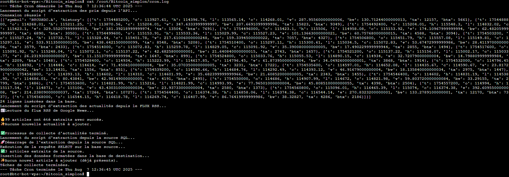

# Rapport d'Épreuve E5 : Surveillance, Déploiement et Résolution d'Incidents en Production (C19, C20, C21)

Projet : **Bitcoin Analyzer**
Candidat : Rida Boualam
Date : Juillet 2025
Certification Visée : RNCP37827 - Développeur en Intelligence Artificielle

## Table des Matières

1.  Introduction : De la Fonctionnalité à la Fiabilité Opérationnelle
    1.1. Contexte de l'Épreuve E5
    1.2. L'Approche MLOps : Vers une Application Déployée et Autonome
2.  Pérennisation et Déploiement des Services (C19)
    2.1. Du Serveur de Développement à un Service de Production avec Systemd
    2.2. Automatisation de la Collecte de Données avec Cron
3.  Surveillance de l'Application en Production (C20)
    3.1. Stratégie de Journalisation Multi-Niveaux
    3.2. Preuve de Monitoring : Analyse de Logs pour une Traçabilité Complète
4.  Résolution d'Incidents en Conditions Réelles (C21)
    4.1. Méthodologie de Résolution d'Incidents
    4.2. Incident 1 : Pivot Stratégique face à la Fragilité du Web Scraping
    4.3. Incident 2 : Erreur de Base de Données en Production
    4.4. Incident 3 : Conflit de Port sur le Serveur de Déploiement
5.  Conclusion de l'Épreuve E5

## 1. Introduction : De la Fonctionnalité à la Fiabilité Opérationnelle

### 1.1. Contexte de l'Épreuve E5

Après avoir développé et testé une application fonctionnelle, le défi ultime est de la transformer en un service fiable, autonome et maintenable en conditions de production. Une application qui fonctionne sur un poste de développeur n'est pas une application de production. Cette épreuve documente les dernières étapes cruciales du cycle de vie du projet "**Bitcoin Analyzer**" : son déploiement sur un serveur cloud, la mise en place de mécanismes de surveillance et la résolution d'incidents techniques réels.

Cette épreuve se concentre sur les compétences fondamentales du **MLOps** :

*   **C19** : Créer un processus de livraison continue (ici étendu à la pérennisation des services).
*   **C20** : Surveiller une application d'intelligence artificielle.
*   **C21** : Résoudre les incidents techniques.

### 1.2. L'Approche MLOps : Vers une Application Déployée et Autonome

Cette épreuve incarne la boucle de rétroaction ("feedback loop") de la philosophie **MLOps**. Le déploiement et l'automatisation (**Cron**, **Systemd**) créent un service vivant. La journalisation (logging) fournit les données pour en comprendre le comportement. Enfin, la résolution d'incidents utilise ces données pour améliorer la robustesse du système.

## 2. Pérennisation et Déploiement des Services (C19)

### 2.1. Du Serveur de Développement à un Service de Production avec Systemd

**Problématique** : Lancer les serveurs manuellement dans un terminal n'est pas une solution viable en production. En cas de fermeture du terminal ou de redémarrage du serveur, l'application s'arrête.

**Solution Professionnelle** : Pour transformer l'application en un service robuste, **Systemd**, le gestionnaire de services standard de Linux, a été utilisé pour piloter **Gunicorn**.

*   **Service pour l'API** (*gunicorn_api.service*) : Un fichier de service a été créé pour lancer l'API **FastAPI**. La directive `Restart=always` garantit que le service redémarrera automatiquement en cas de crash.
*   **Service pour le Frontend** (*gunicorn_django.service*) : Un second service a été créé pour **Django**. Une dépendance (`After=gunicorn_api.service`) assure que le backend est toujours démarré avant le frontend.

**Résultat** : L'application est maintenant entièrement gérée par le système d'exploitation, garantissant une haute disponibilité et complétant le cycle de vie du déploiement.

### 2.2. Automatisation de la Collecte de Données avec Cron

**Problématique** : Une fois déployée, l'application affichait des données statiques qui ne s'actualisaient qu'après une intervention manuelle, ce qui est inacceptable pour un service d'analyse financière.

**Solution Professionnelle** : Une tâche **Cron**, l'utilitaire standard de Linux, a été configurée pour exécuter le script `run_scripts.sh` toutes les heures, rendant la chaîne de collecte de données (**C1**) entièrement autonome.

**Contenu de la Crontab** :

```bash
# Exécute le script de collecte toutes les heures et redirige la sortie vers un fichier de log.
0 * * * * cd /root/Bitcoin_simplon/ && /root/Bitcoin_simplon/venv/bin/python /root/Bitcoin_simplon/run_scripts.sh >> /root/Bitcoin_simplon/cron.log 2>&1
```

Cette automatisation transforme le projet en un service vivant, dont le fonctionnement peut être surveillé via le fichier `cron.log`.

## 3. Surveillance de l'Application en Production (C20)

### 3.1. Stratégie de Journalisation Multi-Niveaux

Pour obtenir une visibilité complète sur le système en production, une stratégie de journalisation a été implémentée à plusieurs niveaux :

*   **Logs Applicatifs** (**Django** & **FastAPI**) : Tracent le flux des requêtes, les appels à l'IA et les erreurs internes.
*   **Logs des Services** (**Systemd**) : La commande `journalctl -u gunicorn_api.service` permet de surveiller la santé des processus serveurs (démarrage, arrêts, erreurs critiques).
*   **Logs d'Automatisation** (**Cron**) : Le fichier `cron.log` fournit un historique des exécutions de la collecte de données, permettant de vérifier son bon déroulement et de diagnostiquer les échecs.

### 3.2. Preuve de Monitoring : Analyse de Logs pour une Traçabilité Complète

En corrélant ces différentes sources de logs, il est possible de reconstituer une chaîne d'événements complète pour diagnostiquer un problème, démontrant une surveillance efficace. Par exemple, si un utilisateur signale des données non à jour, un ingénieur peut :

*   Consulter `cron.log` pour voir si la dernière tâche de collecte a échoué.
*   Inspecter les logs de `gunicorn_api.service` avec `journalctl` pour s'assurer que l'API n'a pas crashé.
*   Analyser les logs de l'API **FastAPI** pour y chercher des erreurs de connexion à la base de données.

*Consultation de cron.log sur le VPS*



## 4. Résolution d'Incidents en Conditions Réelles (C21)

Un développeur compétent n'est pas celui qui n'a pas de bugs, mais celui qui sait les résoudre de manière méthodique.

### 4.1. Méthodologie de Résolution d'Incidents

Pour chaque incident, j'ai appliqué un processus structuré en 5 étapes documenté dans `suivi_projet.md` :

*   **Contexte** : Description de l'opération en cours.
*   **Symptôme** : Description du problème observé.
*   **Diagnostic** : Analyse des logs et du code pour trouver la cause racine.
*   **Résolution** : Description des actions correctives.
*   **Leçon Apprise** : Comment éviter que l'incident se reproduise.

### 4.2. Incident 1 : Pivot Stratégique face à la Fragilité du Web Scraping

**Contexte** : La collecte des actualités reposait initialement sur du scraping d'un site dynamique avec `undetected-chromedriver`. Cette solution fonctionnait mais était techniquement complexe.

**Symptôme** : Le script a commencé à échouer de manière imprévisible (erreurs `HTTP 403: Forbidden`, `Captchas`), compromettant la fiabilité de la chaîne de données.

**Diagnostic** : Le site cible avait renforcé ses protections anti-bot. S'engager dans une "course à l'armement" pour les contourner aurait été coûteux et peu fiable.

**Résolution** : Une décision stratégique a été prise : abandonner cette approche fragile au profit d'une solution standard et robuste. Le script `extraction_news.py` a été réécrit pour utiliser la bibliothèque `feedparser` et consommer le flux RSS de **Google News**, une source conçue pour l'échange automatisé d'informations.

**Leçon Apprise** : La robustesse et la maintenabilité d'une solution priment sur la complexité technique. Savoir pivoter vers une approche plus simple et plus fiable est une compétence d'ingénierie essentielle.

### 4.3. Incident 2 : Erreur de Base de Données en Production

**Contexte** : Après le déploiement de l'API et de la base de données **PostgreSQL** sur leurs services respectifs (VPS et **Render**).

**Symptôme** : L'API **FastAPI** retournait une erreur **500**. Les logs du service (`journalctl -u gunicorn_api.service`) affichaient `psycopg2.errors.UndefinedTable: relation "bitcoin_prices" does not exist`.

**Diagnostic** : L'API se connectait bien à la base de données de production, mais celle-ci était vide. L'enquête a révélé que les scripts de collecte, lancés sur le VPS, n'utilisaient pas la variable d'environnement `DATABASE_URL` et continuaient d'écrire dans une base **SQLite** locale, invisible pour l'API.

**Résolution** : Le code de connexion à la base de données a été refactorisé pour utiliser la variable d'environnement `DATABASE_URL` si elle est présente. Après déploiement de la correction, une nouvelle exécution des scripts a correctement peuplé la base de données de production.

**Leçon Apprise** : La cohérence de la configuration est cruciale dans une architecture distribuée. Tous les composants, y compris les scripts de support, doivent utiliser la même source de vérité pour la configuration.

### 4.4. Incident 3 : Conflit de Port sur le Serveur de Déploiement

**Contexte** : Tentative de redémarrage manuel de l'API avec **Gunicorn** sur le VPS.

**Symptôme** : Le serveur **Gunicorn** refusait de démarrer, affichant l'erreur `address already in use` sur le port **8001**.

**Diagnostic** : La commande `lsof -i :8001` a révélé que des processus **Gunicorn** "zombies" d'une précédente tentative de déploiement tournaient toujours en arrière-plan et occupaient le port.

**Résolution** : La commande `pkill -f gunicorn` a été utilisée pour arrêter proprement tous les processus **Gunicorn** existants, libérant ainsi le port.

**Leçon Apprise** : La gestion des processus est une compétence fondamentale de l'administration système. La mise en place des services **systemd** a par la suite permis d'éviter ce genre de problème en gérant proprement le cycle de vie des processus.

## 5. Conclusion de l'Épreuve E5

Cette épreuve finalise le cycle de vie du projet en démontrant la capacité à transformer une application fonctionnelle en un service de production fiable, autonome et maintenable. La mise en place d'une journalisation complète sur plusieurs niveaux (**C20**) a fourni les outils pour observer et diagnostiquer le système en conditions réelles. La résolution documentée de plusieurs incidents de production concrets (**C21**) a prouvé une approche méthodique face aux défis du déploiement.

Le projet "**Bitcoin Analyzer**" est désormais doté des mécanismes de surveillance et de la robustesse acquise par la résolution d'incidents, le préparant ainsi à une exploitation continue et fiable.